# 专利技术交底书

| 第一发明人（必填） |  | ☐ 校招 / ☐ 社招（必选） |
|---|---|---|
| 其他发明人（不超过3人） |  |  |
| （以下由交底书撰写人填写） |  | （以下由知识产权部填写） |
| 撰写人 |  | 专利类型：发明 |
| 手机 |  | 知识产权负责人 |
| 座机 |  | 联系电话 |
| E－mail |  | E－mail |

**一种基于车辆动力学可微闭环仿真的车辆横纵向控制器参数自动整定方法**

<!-- 版本时间：20260710170336；内容基线：V7；版式母版：20260710124017 -->

## 一、技术背景、最接近现有技术及现有技术缺点

### 1.1 现有技术

检索说明：围绕“车辆横向控制参数调节”“车辆纵向控制参数优化”“车辆横纵向控制”“车辆控制器标定”“可微物理系统”“车辆动力学神经网络模型”和“自动微分调参”等方向，对公开专利与论文进行了复核。与本案关系较近的公开材料如下。

#### 1.1.1 车辆横向控制参数在线调节

**公开材料：** CN119734760A，一种车辆横向控制参数调节方法及系统。

**公开内容：** 该方案根据目标位置点与实际位置之间的偏差，结合车辆动态状态和道路曲率等信息，计算前馈补偿与 LQR 调整量，并对方向盘转角进行约束。

**与本案的区别：** 该方案面向车辆运行过程中的横向控制量调整，未公开把既有横向、纵向工程控制器的标定参数作为待优化变量，也未公开在多轨迹、多速度车辆动力学闭环中通过时间反向传播和参数投影自动生成可部署参数。

**公开来源：** [https://patents.google.com/patent/CN119734760A/zh](https://patents.google.com/patent/CN119734760A/zh)

#### 1.1.2 横向标定参数的动态选择

**公开材料：** US11731648B2，Vehicle lateral-control system with dynamically adjustable calibrations。

**公开内容：** 该方案根据天气、道路图像和车辆状态等信息选择或调整车辆横向控制特征的标定值，使横向控制适应不同运行条件。

**与本案的区别：** 该方案侧重依据环境和车辆状态选择横向标定，未公开以车辆动力学闭环综合损失为目标，同时整定横向参数表节点和纵向控制参数，也未公开训练路径与硬逻辑验证路径共享参数的双模式结构。

**公开来源：** [https://patents.google.com/patent/US11731648B2/en](https://patents.google.com/patent/US11731648B2/en)

#### 1.1.3 基于载重辨识的纵向控制参数优化

**公开材料：** CN120517441A，一种基于载重辨识的车辆纵向控制参数优化方法及装置。

**公开内容：** 该方案基于纵向动力学关系估计车辆载重，并利用更新后的载重值修正油门和制动控制量，以减小载重变化引起的纵向响应偏差。

**与本案的区别：** 该方案解决在线载重辨识及纵向控制量修正问题，未把横向、纵向工程控制器的内部标定参数统一放入多周期闭环中求取梯度，也未涉及硬限幅、硬分支和硬速率限制的部署前复验。

**公开来源：** [https://patents.google.com/patent/CN120517441A/zh](https://patents.google.com/patent/CN120517441A/zh)

#### 1.1.4 道路边界约束下的横纵向控制

**公开材料：** CN120308157A，一种基于道路边界约束的车辆横纵向控制方法及装置。

**公开内容：** 该方案建立车辆非线性模型及其状态转移关系，结合道路边界约束求解控制变量序列，并据此生成车辆控制指令。

**与本案的区别：** 该方案的优化对象主要是当前规划或控制周期内的控制变量序列；本案的优化对象是已有工程控制器中的标定参数，并通过多场景闭环展开、自动微分、物理投影和硬逻辑复验形成参数交付闭环。

**公开来源：** [https://patents.google.com/patent/CN120308157A/zh](https://patents.google.com/patent/CN120308157A/zh)

#### 1.1.5 车辆控制器标定设备和通信流程

**公开材料：** CN112039742A，一种标定设备、车辆控制器标定方法及装置。

**公开内容：** 该方案利用处理器、存储器、CAN 收发器和通信接口向车辆控制器发送标定指令并接收响应，用于简化标定设备与车辆控制器之间的操作流程。

**与本案的区别：** 该方案关注标定设备、指令传输和响应确认，未公开如何根据轨迹跟踪误差构建可微目标函数、计算控制器参数梯度并完成多场景闭环复验。

**公开来源：** [https://patents.google.com/patent/CN112039742A/zh](https://patents.google.com/patent/CN112039742A/zh)

#### 1.1.6 利用学习型评价器调节自动驾驶规划器

**公开材料：** CN115907250A，用于调整自主驾驶车辆的运动规划器的基于学习的评论器。

**公开内容：** 该方案利用学习型评价器评价运动规划器输出，并据此调节运动规划器参数，以改善自动驾驶运动规划结果。

**与本案的区别：** 该方案面向运动规划器参数，不是面向既有车辆横向和纵向控制器的工程标定参数；其也未公开机理车辆模型与可选冻结残差模型组成的被控对象、控制周期级闭环时间展开及原始硬逻辑复验。

**公开来源：** [https://patents.google.com/patent/CN115907250A/zh](https://patents.google.com/patent/CN115907250A/zh)

#### 1.1.7 面向物理系统的可微机器

**公开材料：** US20220171353A1，Differentiable machines for physical systems。

**公开内容：** 该方案公开了能够对物理系统进行仿真、估计或控制的可微计算结构，使系统输出能够对模型或控制相关变量求导。

**与本案的区别：** 该方案属于通用可微物理系统框架，未具体公开车辆横向—纵向工程控制器的双模式复现、参数表节点整定、车辆物理参数域随机化、部署格式导出和硬逻辑验收门槛的组合。

**公开来源：** [https://patents.google.com/patent/US20220171353A1/en](https://patents.google.com/patent/US20220171353A1/en)

#### 1.1.8 神经网络车辆动力学模型

**公开材料：** US12007778B2，Neural network based vehicle dynamics model。

**公开内容：** 该方案利用神经网络车辆动力学模型，根据车辆状态和控制输入预测车辆后续状态，可用于车辆运动预测或控制相关处理。

**与本案的区别：** 该方案重点在学习车辆动力学映射本身，未公开在控制器整定阶段冻结残差模型权重、让梯度穿过残差映射回到工程控制器参数，并通过分布外距离和组件消融判断模型失效来源。

**公开来源：** [https://patents.google.com/patent/US12007778B2/en](https://patents.google.com/patent/US12007778B2/en)

#### 1.1.9 基于自动微分的控制器调参

**公开材料：** DiffTune: Auto-Tuning through Auto-Differentiation，arXiv:2209.10021。

**公开内容：** 该论文把控制器调参表述为动态系统与控制器展开后的参数优化问题，并利用自动微分获得控制器参数的更新方向。

**与本案的区别：** 该论文提供通用自动微分调参思想，但未公开针对车辆横向和纵向工程控制器的参数识别与分组、训练/验证双模式逻辑、机理基础加可选冻结 MLP 残差、批量多场景软基线归一化、参数配置导出及硬逻辑复验的完整工程组合。

**公开来源：** [https://arxiv.org/abs/2209.10021](https://arxiv.org/abs/2209.10021)

检索总结：上述公开材料分别涉及横向在线调节、横向标定选择、纵向载重补偿、横纵向控制量求解、标定设备、规划器参数调节、可微物理系统、神经车辆动力学模型或通用控制器调参。本案的技术组合仍具有清晰区别：从既有车辆横向和纵向工程控制器中识别待调参数，构建参数共享的可微训练路径和原始硬逻辑验证路径，以机理动力学模型作为基础被控对象并可选叠加冻结的 MLP 残差，在多轨迹、多速度和多车辆参数域中进行控制周期级闭环展开，以归一化综合损失反向更新并投影参数，最后在硬逻辑路径中复验并导出可部署配置。

### 1.2 现有技术存在的缺点

（1）现有车辆横向控制参数调节方案多为在线查表、按偏差动态调节或稳定性测试后优化，难以一次性利用多轨迹、多速度和多车辆参数域数据对整组控制器参数进行全局整定。

（2）现有纵向控制优化方案多围绕载重辨识、驾驶风格学习或油门/制动控制量修正展开，未与横向控制器参数、轨迹跟踪误差和车辆动力学闭环统一建模。

（3）现有车辆动力学控制方案常用于轨迹控制量求解、稳定控制或特殊工况处置，优化对象通常是控制量序列或附加力矩，而不是已有工程控制器内部标定参数。

（4）现有标定设备方案关注通信、指令下发和人工标定流程便利性，无法自动给出参数梯度、参数更新方向和部署前闭环验证结果。

（5）现有可微仿真训练方案多用于端到端神经网络策略，若直接用于工程车辆控制器，容易忽略硬限幅、查表、分支逻辑和参数边界，导致训练结果难以直接部署。

（6）现有方法缺乏训练路径与验证路径分离而参数共享的结构，难以兼顾“可微训练需要平滑近似”和“工程部署需要原始硬逻辑”两类要求。

（7）现有车辆控制器整定方案通常把被控对象简化为纯机理模型或固定仿真器，较少公开将机理动力学模型与冻结的 MLP 残差模型组合为可微被控对象，并进一步通过 MLP 输入输出可视化、分布外距离和组件消融来区分控制器问题与车辆模型失效。

## 二、本发明所要解决的技术问题

本发明所要解决的技术问题在于，在不改变既有车辆横向、纵向工程控制器主体结构的前提下，构建能够用于参数自动整定的车辆动力学可微闭环仿真环境，使控制器参数能够根据轨迹跟踪误差、速度误差和控制平滑性指标自动更新。

进一步地，本发明还解决训练可微性与工程可部署性之间的冲突：训练阶段允许对限幅、分段切换、速率限制等非光滑环节采用可微近似，以便获得参数更新方向；验证和部署前仍使用原始硬限幅、硬分支和硬速率限制进行闭环复验，以保证整定参数能够回到原工程控制模块中使用。

此外，本发明还解决被控对象精度和整定可微性之间的协调问题。基础实施方式由机理动力学模型给出车辆运动响应；在需要进一步补偿机理模型与高保真车辆响应差异时，可选叠加预训练 MLP 残差模型。启用该残差模型时，其权重在控制器参数整定阶段保持冻结，系统仅利用输入输出映射修正车辆状态并传递梯度。

在启用 MLP 残差增强的实施方式中，本发明还解决闭环异常原因难以归因的问题。系统可捕获 MLP 输入、归一化距离、残差输出和车辆响应，形成静态扫描、闭环时序、输入分布外距离、组件消融和跨场景汇总等诊断结果，用于判断异常主要来源于控制器参数不足、车辆机理模型失配，还是残差模型在分布外输入下失效。

本发明还解决多轨迹、多速度和车辆物理参数不确定性下的统一整定问题，使横向预瞄、收敛、角速度误差预瞄、纵向站位环（位置误差环）和速度环等多类参数能够在同一批量闭环训练过程中协同更新，并通过物理边界约束、硬逻辑复验、必要时的残差诊断图和日志产物保证整定过程可追溯。

## 三、本发明技术方案的详细阐述

### 3.1 背景

自动驾驶车辆控制模块通常以固定周期运行，横向控制器根据参考轨迹、当前车辆位置、航向、速度和曲率等信息给出转向相关指令，纵向控制器根据目标速度、当前位置误差和速度误差给出加速度或扭矩相关指令。工程控制器内部往往包含查表、限幅、分段切换、速率限制和安全保护逻辑，这些逻辑对部署可靠性很重要，但也会使传统手工调参依赖大量试验和经验。

本发明将已有工程控制器复现为双模式结构：训练模式保留主要物理关系并对非光滑环节采用可微近似，验证模式保留原始硬逻辑。两种模式共享同一组待整定参数。通过车辆动力学模型把多个控制周期串联成闭环时间链路，综合损失可以沿时间反向传播到控制器参数，从而自动得到参数更新方向。

在重卡或牵引车-挂车实施场景中，机理动力学模型根据车辆质量、轴距、侧偏刚度、轮胎半径、传动扭矩和铰接约束等给出下一周期的名义状态。在需要补偿机理模型剩余误差时，可选 MLP 残差模型接收车辆状态、控制指令和车辆配置等特征，输出速度或位姿残差，并将其转换为车辆状态修正；该可选模型在控制器参数整定阶段不更新权重。

### 3.2 系统框图

图1示出了本发明的一种系统组成。系统按功能共包括 13 个模块或子模块：原始控制器代码/参数表、双模式控制器、机理动力学模型、可选 MLP 残差模型、多场景轨迹库、训练增强模块、闭环展开模块、损失计算模块、自动微分模块、参数投影模块、产物生成模块、硬逻辑复验模块和可选残差模型诊断模块。机理动力学模型为被控对象的基础，可选残差模型作为独立子模块叠加状态修正；各模块形成从工程控制器复现、闭环车辆响应仿真、参数更新、部署验证到按需异常归因的闭环流程。

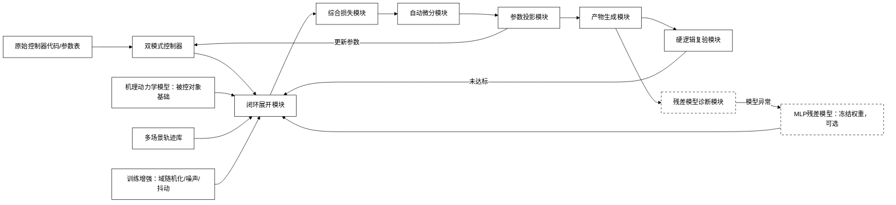
<!-- 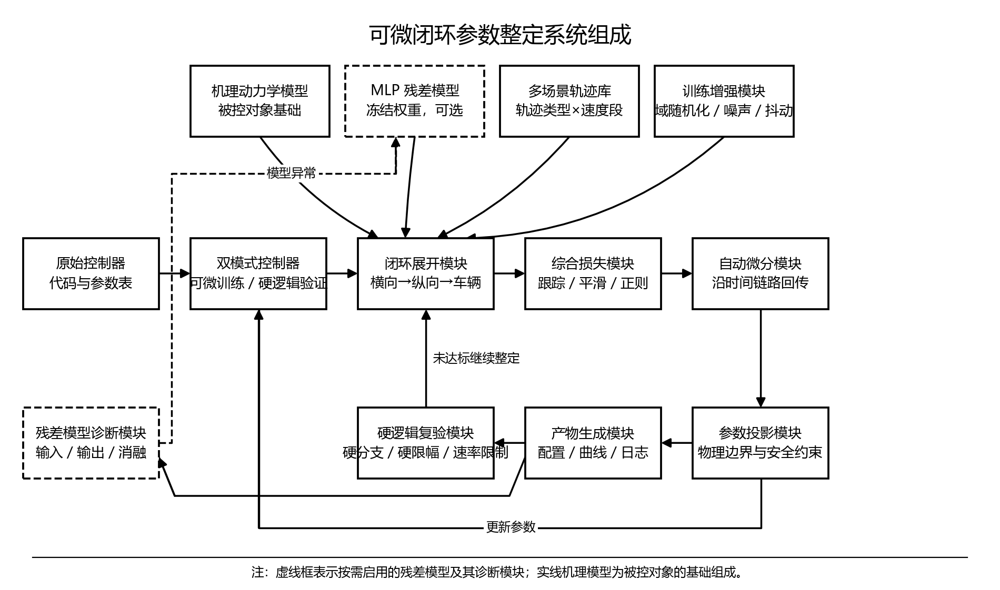 -->

### 3.3 模块功能说明

（1）原始控制器代码/参数表用于提供待复现的横向和纵向工程控制逻辑，并给出初始标定参数、车辆物理常数和安全边界。

（2）双模式控制器用于在训练模式下提供可微计算路径，在验证模式下提供与工程控制器一致的硬逻辑路径。同一组整定参数在两个模式中共享。

（3）机理被控对象模块用于模拟车辆在控制指令作用下的下一周期主体响应，并构成每种实施方式均包含的基础被控对象；在需要提高模型逼真度时，可进一步叠加 MLP 残差模型。机理动力学模型负责表达车辆质量、轴距、轮胎侧偏、传动扭矩、铰接约束、空气阻力和滚阻等确定性物理关系；MLP 残差模型负责补偿机理模型与高保真仿真或实车数据之间的剩余误差。

（4）可选 MLP 残差模型用于根据车辆状态、控制指令、车辆配置、铰接状态和归一化统计量等输入特征输出运动残差。运动残差可以包括牵引车速度残差、挂车速度残差和相对位姿残差。残差经坐标转换、限幅和必要的掩码处理后叠加到机理模型的下一周期状态上。MLP 权重在控制器整定阶段保持冻结，梯度仅通过其输入输出计算链路回传到控制器参数。

（5）多场景轨迹库用于提供换道、双换道、渐变曲率弯道、S弯、弯前减速和换道加减速等场景，并覆盖多个速度段。

（6）训练增强模块用于在训练阶段引入车辆物理参数域随机化、反馈噪声和指令抖动，避免控制器参数仅适配单一车辆或单一无扰动输入。

（7）闭环展开模块用于按控制周期串联横向控制器、纵向控制器和机理被控对象；在启用残差增强时，再串联 MLP 残差状态修正，使每一时刻的状态变化都依赖前一时刻的控制结果。

（8）损失计算模块用于评价横向误差、航向误差、速度误差、转向平滑性、加速度平滑性和参数偏移，得到可优化的综合损失。

（9）自动微分模块用于沿闭环时间链路反向传播，计算综合损失对控制器参数的梯度。对于冻结的 MLP 残差模型，该模块不更新 MLP 权重，只利用其可微映射把车辆响应对控制器参数的影响传递回来。

（10）参数投影模块用于将更新后的参数限制在物理合理范围和安全范围内，防止自动整定越过工程可部署边界。

（11）产物生成模块用于输出整定后的参数配置、训练曲线、参数变化图、验证统计图、诊断图和日志。

（12）硬逻辑复验模块用于使用验证模式运行全场景闭环仿真，检查整定参数在原始硬分支、硬限幅和硬速率限制下的表现。

（13）在启用 MLP 残差增强时，可选残差模型可视化诊断模块用于在闭环异常或部署前复验不达标时，捕获 MLP 的输入特征、归一化后距离、原始残差输出、限幅后残差输出和车辆响应，并生成静态扫描、闭环时序图、输入分布外距离图、危险区热图、组件消融对比图和跨场景汇总图。通过比较“纯机理模型”“机理模型+完整 MLP”“屏蔽部分 MLP 输出分量”等结果，可以判断异常主要来自控制器整定不足，还是来自 MLP 残差模型输出偏置、饱和或分布外失效。

### 3.4 系统流程说明

图2示出了本发明的一种方法流程。

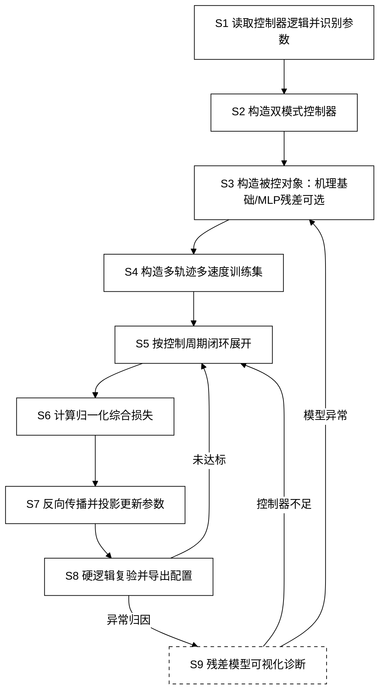
<!-- 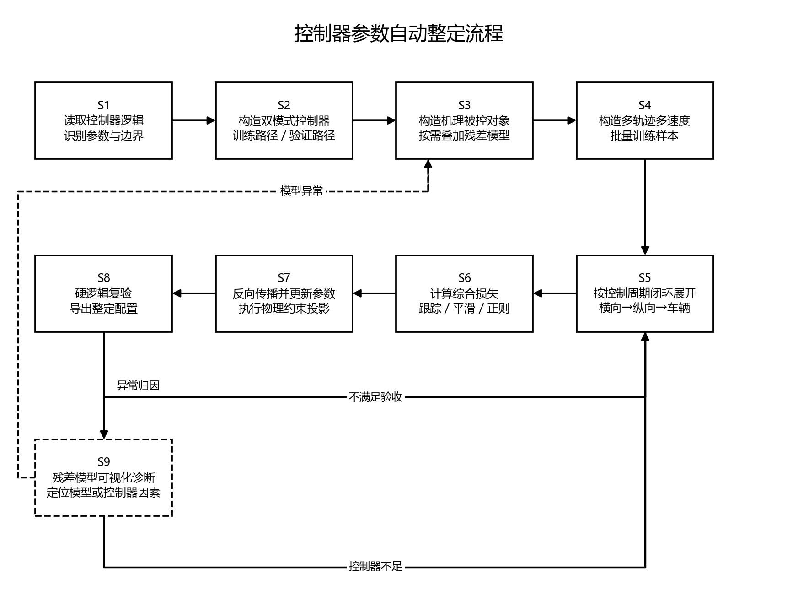 -->

具体流程如下：

S1，读取车辆控制器的原始代码和参数配置，识别可调参数、固定物理参数和安全约束参数。

S2，将横向控制器和纵向控制器封装为双模式控制器。训练模式保留控制器主要物理关系，并对非光滑步骤采用可微近似；验证模式保留原始工程硬逻辑。

S3，构建以机理模型为基础的被控对象，并根据需要构建车辆物理参数域；需要提高逼真度时，可再叠加冻结的 MLP 残差模型。机理模型可以采用运动学自行车模型、动力学自行车模型或牵引车-挂车双体动力学模型。

S4，构造多轨迹多速度训练集，并将轨迹场景、速度段和车辆参数域展开为批量样本。

S5，在每一个控制周期内，依次执行横向控制、纵向控制和机理动力学预测；当残差增强标志为启用时，再执行 MLP 残差修正并推进闭环状态。

S6，根据车辆状态和参考轨迹计算综合损失。

S7，沿时间展开链路反向传播，获得损失对控制器参数的梯度，更新参数并执行物理约束投影；在启用 MLP 残差模型时，其权重保持冻结。

S8，导出整定后的参数配置，并在验证模式下进行硬逻辑复验；若复验不满足要求，则以上一轮参数为起点继续整定或调整训练场景。

S9，在启用残差增强且硬逻辑复验出现异常、部分场景误差显著增大，或需要判断被控对象可信度时，运行 MLP 可视化诊断。若残差模型在无侧向激励基准状态下产生持续偏置、输入远离训练分布、输出频繁达到限幅边界，或屏蔽某一残差分量后异常消失，则优先判断为残差模型失效；若纯机理路径和残差增强路径表现相似，则优先判断为控制器参数或控制器结构不足。

### 3.4.1 符号与公式

#### （1）符号与变量定义

| 符号 | 含义 | 下标或量纲 |
|---|---|---|
| \(b,B\) | 批量场景索引及批量场景数 | \(b=1,\ldots,B\) |
| \(K\) | 同一原始轨迹对应的车辆参数域副本数 | 未启用域随机化时 \(K=1\) |
| \(t,T_b\) | 控制周期索引及第 \(b\) 个场景的末周期 | \(t=0,\ldots,T_b\)，周期可为 0.02 s |
| \(x_{b,t}\) | 车辆状态 | 包括位置、航向、速度、横摆角速度和可选铰接状态 |
| \(r_{b,t}\) | 参考轨迹状态 | 包括参考位置、航向、曲率和速度 |
| \(u_{b,t}=[\delta_{b,t},q_{b,t}]^{\mathsf T}\) | 控制指令 | \(\delta\) 为转向指令，\(q\) 为加速度或扭矩类纵向指令 |
| \(\theta,\theta_0,\theta^*\) | 待整定参数、初始工程参数和最终候选参数 | 含横向参数与纵向参数 |
| \(g_{\mathrm{train}},g_{\mathrm{hard}}\) | 训练路径与硬逻辑验证路径 | 两条路径共享 \(\theta\) |
| \(f_{\mathrm{mech}}(\cdot)\) | 车辆机理动力学状态更新函数 | 根据当前状态、控制指令和 \(\phi_b\) 预测下一周期状态 |
| \(\phi_b\) | 第 \(b\) 个车辆域的机理参数 | 质量、侧偏刚度、轮胎半径、传动及铰接参数等 |
| \(h_{\psi}(\cdot)\) | 可选 MLP 残差模型 | \(\psi\) 在控制器整定期间冻结 |
| \(z_{b,t},\mathcal T(\cdot),\alpha\) | 残差输入、状态转换算子和残差启用标志 | \(\alpha=0\) 为纯机理，\(\alpha=1\) 为混合被控对象 |
| \(e_{b,t,\mathrm{lat}},e_{b,t,\mathrm{head}},e_{b,t,\mathrm{spd}}\) | 横向、航向和速度跟踪误差 | 分别为 m、rad、m/s 或相应归一化量 |
| \(\Delta\delta_{b,t},\Delta q_{b,t}\) | 相邻周期控制增量 | \(\delta_{b,t}-\delta_{b,t-1}\)、\(q_{b,t}-q_{b,t-1}\)，从 \(t=1\) 起计算 |
| \(w_{\mathrm{lat}},w_{\mathrm{head}},w_{\mathrm{spd}},w_{\delta},w_q\) | 三类跟踪误差及两类控制增量的权重 | 均为非负预设值，且至少一个跟踪误差权重大于零 |
| \(\ell_b,\bar\ell_{b,\mathrm{ref}},\varepsilon\) | 场景损失、固定参考基线和防零常数 | 域随机化时基线先在同一轨迹的 \(K\) 个车辆域上取均值并停止梯度 |
| \(\gamma,\nu_b,\nu_{\min}\) | 软归一化指数、场景归一化因子和中位数下限 | 实施例 \(\gamma=0.5\)，\(\nu_b\) 由式（5）确定 |
| \(J,\lambda\) | 批量归一化目标和参数偏移正则权重 | 无量纲或归一化后加权 |
| \(k,\eta_k,\Theta,\Pi_{\Theta}\) | 迭代编号、学习率、可行域和投影算子 | 投影后参数位于工程边界内 |
| \(d_{b,t}^{\mathrm{ood}},\tau_{\mathrm{ood}}\) | 残差模型输入的分布外距离及其诊断阈值 | 仅在启用残差模型时用于诊断，不作为 MLP 权重训练目标 |
| \(M_{\mathrm{hard}}\) | 原始硬逻辑复验过程 | 保留硬分支、硬限幅和硬速率限制 |

#### （2）双模式控制器与闭环状态更新

对于批量中的第 \(b\) 个场景，控制器映射表示为：

<!-- EQ1 -->
\[
u_{b,t}=g_m\!\left(x_{b,t},r_{b,t},\theta\right),\qquad m\in\{\mathrm{train},\mathrm{hard}\} \qquad \mathrm{(1)}
\]

其中，训练路径 \(g_{\mathrm{train}}\) 对必要的非光滑环节采用可微近似，验证路径 \(g_{\mathrm{hard}}\) 保留工程控制器的原始硬逻辑；二者读取同一组参数 \(\theta\)。

机理动力学模型给出下一周期的主体状态预测：

<!-- EQ2 -->
\[
x^{\mathrm{mech}}_{b,t+1}=f_{\mathrm{mech}}\!\left(x_{b,t},u_{b,t},\phi_b\right) \qquad \mathrm{(2)}
\]

在需要提高车辆响应逼真度时，可在机理模型基础上叠加冻结的 MLP 残差：

<!-- EQ3 -->
\[
x_{b,t+1}=x^{\mathrm{mech}}_{b,t+1}+\alpha\,\mathcal{T}\!\left(h_{\psi}(z_{b,t})\right),\qquad \alpha\in\{0,1\} \qquad \mathrm{(3)}
\]

式（3）用 \(\alpha\) 明确区分两种实施方式：机理模型是基础且必需的被控对象；MLP 残差模型是可选增强。启用残差模型时，梯度可以穿过其输入输出映射回到控制器参数，但 \(\psi\) 不更新。

#### （3）场景损失与批量软基线归一化

第 \(b\) 个场景的损失为：

<!-- EQ4 -->
\[
\begin{aligned}\ell_b(\theta)=&\frac{1}{T_b+1}\sum_{t=0}^{T_b}\!\left(w_{\mathrm{lat}}e_{b,t,\mathrm{lat}}^2+w_{\mathrm{head}}e_{b,t,\mathrm{head}}^2+w_{\mathrm{spd}}e_{b,t,\mathrm{spd}}^2\right)\\&+\frac{1}{T_b}\sum_{t=1}^{T_b}\!\left(w_{\delta}\lVert\Delta\delta_{b,t}\rVert^2+w_q\lVert\Delta q_{b,t}\rVert^2\right)\end{aligned} \qquad \mathrm{(4)}
\]

控制增量从 \(t=1\) 起求和，因此不需要定义不存在的前一周期指令。为避免长轨迹或初始误差较大的场景支配梯度，将场景损失按固定软基线进行带指数和中位数下限的软归一化，再取批量平均：

<!-- EQ5 -->
\[
\begin{aligned}\nu_{\min}&=\left[\operatorname{median}_{j}\!\left(\bar\ell_{j,\mathrm{ref}}+\varepsilon\right)\right]^{\gamma},\\\nu_b&=\max\!\left\{\left(\bar\ell_{b,\mathrm{ref}}+\varepsilon\right)^{\gamma},\nu_{\min}\right\},\\J(\theta)&=\frac{1}{B}\sum_{b=1}^{B}\frac{\ell_b(\theta)}{\nu_b}+\lambda\lVert\theta-\theta_0\rVert^2\end{aligned} \qquad \mathrm{(5)}
\]

其中，\(\bar\ell_{b,\mathrm{ref}}\) 由首轮或初始参数结果取得并在后续训练中停止梯度；启用车辆域随机化时，同一原始轨迹在 \(K\) 个车辆域副本上的首轮损失先取均值，再复制为这些副本共享的参考基线。实施例取 \(\gamma=0.5\)，\(\nu_{\min}\) 为全部参考基线经同次幂变换后的中位数下限。图中分项曲线记录未归一化原始损失，总目标曲线记录式（5）的软归一化批量目标；二者数值尺度不同，不应直接相加比较。

#### （4）参数更新、硬逻辑复验与诊断

参数更新和物理边界投影表示为：

<!-- EQ6 -->
\[
\theta^{k+1}=\Pi_{\Theta}\!\left(\theta^k-\eta_k\nabla_{\theta}J(\theta^k)\right) \qquad \mathrm{(6)}
\]

可采用截断时间反向传播控制单次反传长度，并在更新前执行梯度范数裁剪。训练结束得到 \(\theta^*\) 后，在原始硬逻辑路径中运行全场景复验：

<!-- EQ7 -->
\[
M_{\mathrm{hard}}(\theta^*)\longrightarrow\{\mathrm{trajectory},\mathrm{error},\mathrm{command},\mathrm{log}\} \qquad \mathrm{(7)}
\]

只有当轨迹误差、速度误差、控制指令连续性和安全边界均满足预设门槛时，才输出可部署参数。在启用残差增强且触发或选择执行残差模型诊断时，诊断结果还应确认未出现持续偏置、\(d_{b,t}^{\mathrm{ood}}>\tau_{\mathrm{ood}}\) 的持续超阈或输出长期饱和。否则继续整定、扩充场景，或返回检查被控对象。

### 3.5 关键技术参数

| 符号或参数 | 参数内容 | 约束或范围 | 整定属性 | 作用 |
|---|---|---|---|---|
| \(\theta_{\mathrm{lat}}\) | 横向预瞄、收敛、角速度误差预瞄及远预瞄查表节点 | 受速度段与转向稳定性约束 | 可调 | 决定横向跟踪精度和转向平滑性 |
| \(\theta_{\mathrm{lon}}\) | 站位环（位置误差环）、低速/高速速度环增益及切换速度 | 增益非负，切换速度位于工程范围 | 可调 | 决定速度跟踪和加减速响应 |
| \(\theta_0,\Theta\) | 初始工程参数与参数可行域 | 由原始标定和物理安全边界给定 | 固定基准 | 约束参数偏移和部署范围 |
| \(\phi_b\) | 质量、侧偏刚度、轮胎、传动及铰接参数 | 名义值或预设采样范围 | 固定或采样 | 用于机理模型和车辆域随机化 |
| \(\psi\) | MLP 残差模型权重 | 由离线数据预训练得到 | 冻结 | 可选补偿机理模型的剩余误差 |
| \(\alpha,z_{b,t},\mathcal T\) | 残差启用、输入特征与转换规则 | 与预训练特征、归一化及限幅一致 | 固定规则 | 保证纯机理与混合路径可切换、可诊断 |
| \(d_{b,t}^{\mathrm{ood}},\tau_{\mathrm{ood}}\) | 输入分布外距离及其阈值 | 阈值按归一化特征或训练分位数确定 | 预设 | 判断残差模型是否离开训练分布 |
| \(w_{\mathrm{lat}},w_{\mathrm{head}},w_{\mathrm{spd}}\) | 跟踪误差权重 | 实施例为 10、8、3 | 预设 | 平衡横向、航向和速度目标 |
| \(w_{\delta},w_q\) | 转向及纵向指令增量权重 | 实施例为 0.05、0.01 | 预设 | 分别抑制转向突变和纵向指令突变 |
| \(\bar\ell_{b,\mathrm{ref}},\gamma,\nu_{\min},\varepsilon\) | 固定参考基线、软归一化指数、中位数下限和防零常数 | 基线固定并停止梯度；实施例 \(\gamma=0.5\)，\(\varepsilon>0\) | 预设 | 平衡不同轨迹、速度和车辆域的尺度 |
| \(\lambda\) | 参数偏移正则权重 | 实施例为 0.01 | 预设 | 防止参数无约束偏离工程初值 |
| \(\eta_k,\Pi_{\Theta}\) | 学习率和投影算子 | 结合梯度裁剪及上下界 | 预设 | 稳定更新并维持可部署性 |
| 截断长度与梯度裁剪 | 单次反传周期数及梯度范数上限 | 实施例为 150 周期（约 3 s）和 10 | 预设 | 控制长时闭环反传的数值稳定性 |

## 四、与现有技术相比的有益效果

本发明相较于现有技术至少具有以下有益效果。

（1）本发明不是单纯在线查表调节横向参数，也不是单独优化纵向油门或制动控制量，而是将横向和纵向工程控制器放入同一个车辆动力学闭环中进行联合整定。

（2）本发明通过双模式控制器解决可微训练与工程验证之间的矛盾。训练模式可对非光滑环节做平滑近似以获得梯度，验证模式仍保留原始硬限幅、硬分支和硬速率限制。

（3）本发明能够把多轨迹、多速度和车辆物理参数不确定性纳入同一批量训练过程，降低参数只适配单一车辆或单一场景的风险。

（4）本发明以机理动力学模型构成基础被控对象，并可选叠加 MLP 残差模型，以提高闭环仿真对真实车辆响应或高保真仿真的贴近程度，同时保留机理模型的可解释性和物理边界。

（5）在启用 MLP 残差增强时，本发明在控制器整定阶段冻结 MLP 残差模型权重，只把 MLP 作为被控对象状态更新的一部分使用，避免将车辆模型训练与控制器参数整定混为一个不可追溯的联合优化问题。

（6）本发明通过综合损失同时约束横向误差、航向误差、速度误差、控制平滑性和参数偏移，避免只追求单一误差而牺牲控制稳定性。

（7）本发明通过参数投影模块把自动更新后的参数限制在工程可部署范围内，使输出参数更容易进入原控制模块配置文件。

（8）本发明能够输出训练曲线、参数变化图、硬逻辑验证统计、代表场景对比图和 MLP 可视化诊断图，既便于追溯参数整定过程，也便于判断异常来自控制器还是来自车辆模型残差。

## 五、本发明的技术关键点和保护点

本发明建议按照“方法独立保护、可选残差增强从属保护、系统及介质并列保护”的思路布置权利要求，重点保护以下技术方案和技术特征。

（1）保护一种基于车辆动力学可微闭环仿真的车辆横纵向控制器参数自动整定方法，其核心步骤包括：读取既有工程控制器逻辑及参数配置；构建共享同一参数集合的可微训练路径和硬逻辑验证路径；以机理动力学模型作为必需的被控对象；对多轨迹、多速度场景进行控制周期级闭环展开；根据至少一类跟踪误差构建目标函数；通过自动微分更新控制器参数并执行物理边界投影；最后在原始硬逻辑路径中复验并导出参数配置。

（2）保护双模式控制器结构。训练路径对必要的非光滑环节采用可微近似，验证路径保留原始硬分支、硬限幅和硬速率限制，两条路径读取同一组待整定参数。

（3）保护横向控制、纵向控制和机理动力学预测按控制周期串行展开的闭环链路，使多个周期后的轨迹跟踪结果能够反向影响横向和纵向控制器参数。

（4）保护待整定参数的识别、分组和联合整定方式。参数组至少可包括横向预瞄类、收敛类、角速度误差预瞄类、远预瞄查表节点、纵向站位环（位置误差环）、低速/高速速度环和速度段切换参数。

（5）保护按场景固定参考基线进行软归一化的目标函数构造方式：参考基线停止梯度，按照预设指数进行幂变换，并采用全场景参考基线的中位数形成归一化下限；启用车辆域随机化时，同一原始轨迹的多个车辆域副本共享经域平均得到的参考基线。

（6）保护综合目标函数的构造方式。该目标函数至少包括横向误差、航向误差或速度误差中的一项跟踪误差，并可进一步包括转向指令增量、纵向指令增量和参数偏移正则项中的一项或多项。

（7）保护参数物理投影和可部署配置生成方式：每次参数更新后将其限制在预设物理与安全边界内，并按照原工程控制器所需的数据结构或可转换格式输出参数文件。

（8）保护面向车辆物理参数不确定性的域随机化整定方式，包括对车辆质量、侧偏刚度、轮胎、传动或铰接相关参数进行采样，并在同一批量闭环中共享控制器参数。

（9）保护反馈噪声和指令抖动参与训练的鲁棒整定方式，包括对位置、航向、速度或横摆角速度反馈加入扰动，以及对转向、扭矩或加速度指令加入扰动；验证阶段关闭上述扰动并回到硬逻辑路径。

（10）保护可选的冻结残差模型增强方式：在机理动力学预测基础上叠加预训练 MLP 的状态残差，允许梯度穿过残差模型的输入输出映射回到控制器参数，但控制器整定期间不更新 MLP 权重。

（11）保护可选残差模型的异常归因诊断方式，包括捕获残差模型输入、归一化输入距离、原始及限幅后输出、车辆状态和控制指令，并通过静态扫描、闭环时序、分布外判断及残差分量消融区分控制器不足与残差模型失效。

（12）保护硬逻辑复验门槛：整定完成后，在保留原工程硬逻辑的验证路径中运行全场景闭环，依据跟踪误差、速度误差、控制连续性和安全边界决定是否接受并导出参数；在启用残差增强且触发或选择执行残差模型诊断时，再附加残差模型诊断门槛，判断是否出现持续偏置、输入分布外距离持续超阈或输出长期饱和。

（13）保护实现上述方法的控制器参数自动整定系统，其功能模块至少包括控制器双模式复现、机理动力学闭环展开、场景管理、损失计算、自动微分、参数投影、硬逻辑复验和配置导出模块，并可选包括残差增强与诊断模块。

（14）保护一种电子设备，包括处理器和存储器，所述存储器中存储的程序由处理器执行时实现上述车辆横纵向控制器参数自动整定方法。

（15）保护一种计算机可读存储介质，其上存储有程序，所述程序被处理器执行时实现上述车辆横纵向控制器参数自动整定方法。

## 六、实施例、技术效果和参数示例

### 6.1 实施例一：基于牵引车-挂车模型的横纵向联合整定

在一个实施例中，横向控制器采用重卡横向控制逻辑，纵向控制器包含站位环（位置误差环）、速度环和扭矩输出层。被控对象采用牵引车-挂车机理动力学模型，并启用预训练且权重冻结的 MLP 残差增强，即 \(\alpha=1\)；训练共 6 轮，普通参数与查表参数的初始学习率均为 0.05，并采用余弦退火逐轮降低学习率。训练集由 8 类轨迹模板与 6 个速度段组合形成 48 个场景；轨迹模板包括换道、双换道、渐变曲率弯道、S 弯、弯前减速、换道加减速及其左右方向或速度变化组合，速度段为 5、18、25、35、45 和 55 km/h。验证集在上述 48 个场景基础上增加一条园区综合路线，共 49 个场景。

实验中，式（5）所示的软基线归一化批量目标从 3.9303 下降到 3.0535，下降 22.31%。各分项图记录的是未归一化原始损失，因而其数值不与归一化总目标直接相加。硬逻辑验证路径中，49 个场景里有 38 个场景横向误差下降，43 个场景航向误差下降；横向误差变化平均值为 -11.20%，航向误差变化平均值为 -15.11%。该结果说明，通过可微闭环整定得到的参数在硬逻辑复验中仍具有改善效果。

图3示出了实施例实际训练结果经黑白清稿后的曲线，包括软归一化批量目标和未归一化原始分项损失。归一化总目标下降 22.31%，分项曲线用于判断横向、航向、速度和控制平滑性各自的变化方向。

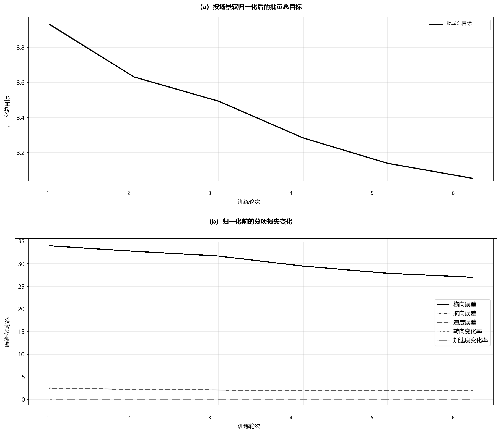

图4示出了关键参数在整定前后的变化，包括 7 个纵向标量参数以及 T2、T3、T4、T6 四组横向查表节点；其中 T2 表示预瞄时间，T3 表示收敛时间，T4 表示角速度误差预瞄时间，T6 表示远预瞄时间。该图用于核对自动更新是否落在工程边界内。

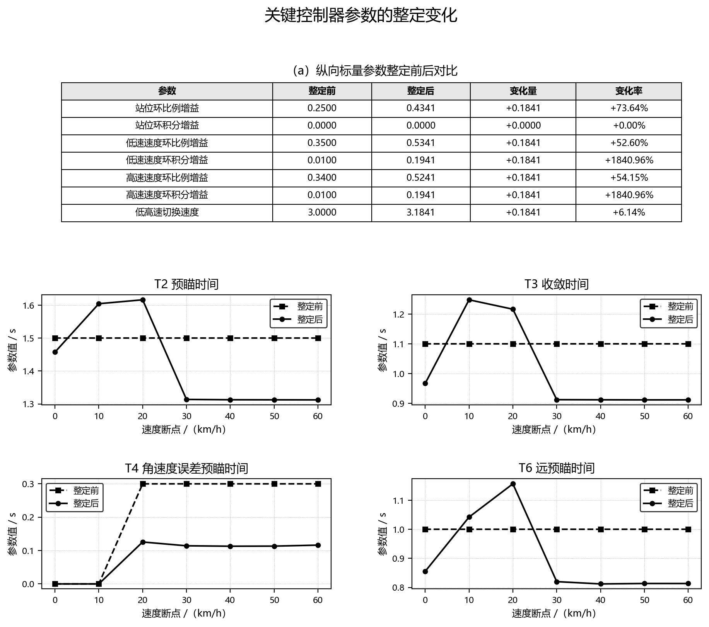

图5(a)列出了实施例一的主要训练配置和总体结果：被控对象采用牵引车-挂车机理模型并启用冻结的 MLP 残差增强（\(\alpha=1\)），训练 6 轮，控制周期为 0.02 s，普通参数和查表参数的初始学习率均为 0.05，并采用余弦退火，训练集为 48 个场景。

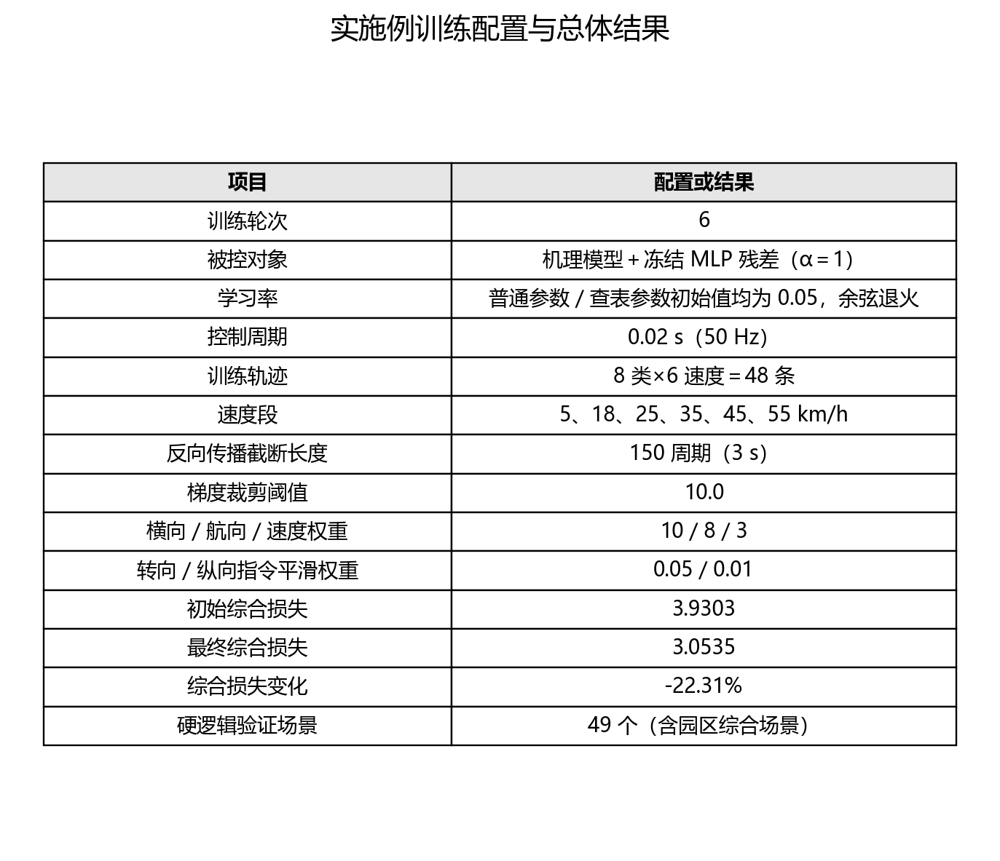

图5(b)给出了 49 个硬逻辑验证场景的统计，其中 38 个场景横向误差下降、43 个场景航向误差下降；横向误差和航向误差的平均变化率分别为 -11.20% 和 -15.11%，并按轨迹类型列出统计结果。

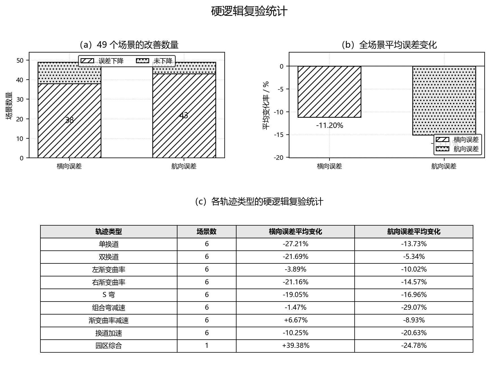

图6(a)和图6(b)分别摘录硬逻辑复验中的单换道、双换道实际轨迹结果，每类覆盖 5、18、25、35、45 和 55 km/h 六个速度段。参考轨迹采用灰色短虚线，整定前轨迹采用灰色间断线，整定后轨迹采用黑色实线；图例括号内为对应横向均方根误差。

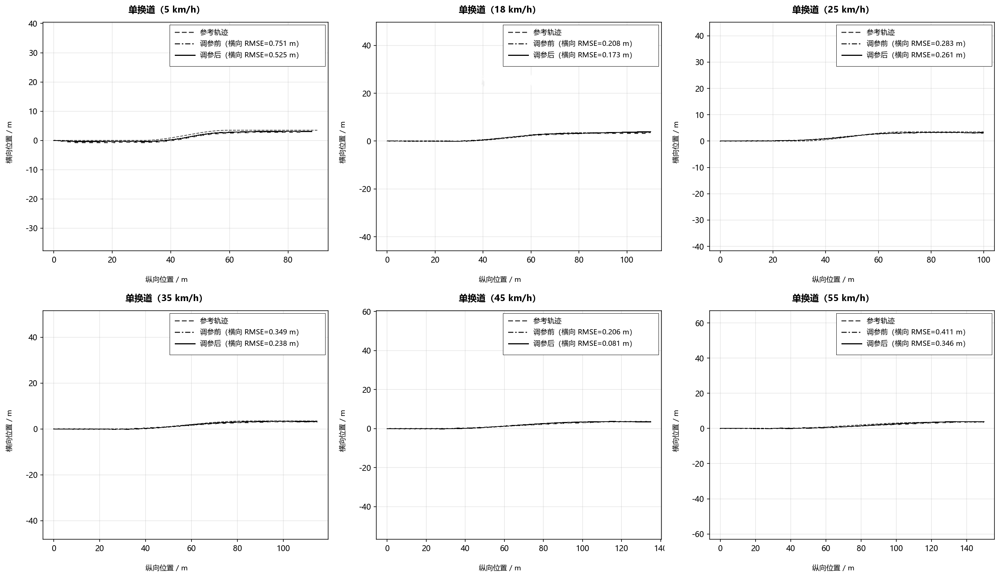

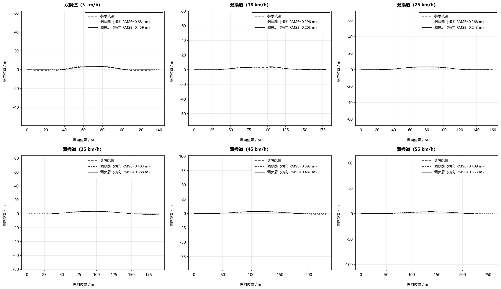

图7(a)和图7(b)给出了与图6相同 12 个实际复验场景的横向误差时序。整定前误差采用灰色间断线，整定后误差采用黑色实线；图例括号内为横向均方根误差。该图用于观察误差幅值、持续时间及局部改善情况，完整 49 场景材料与整定日志一并保存。

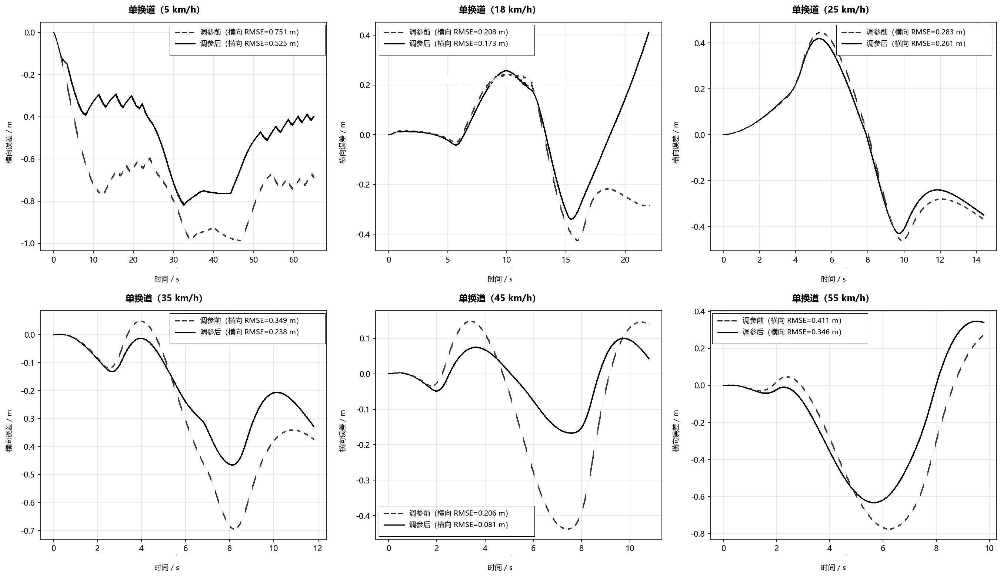

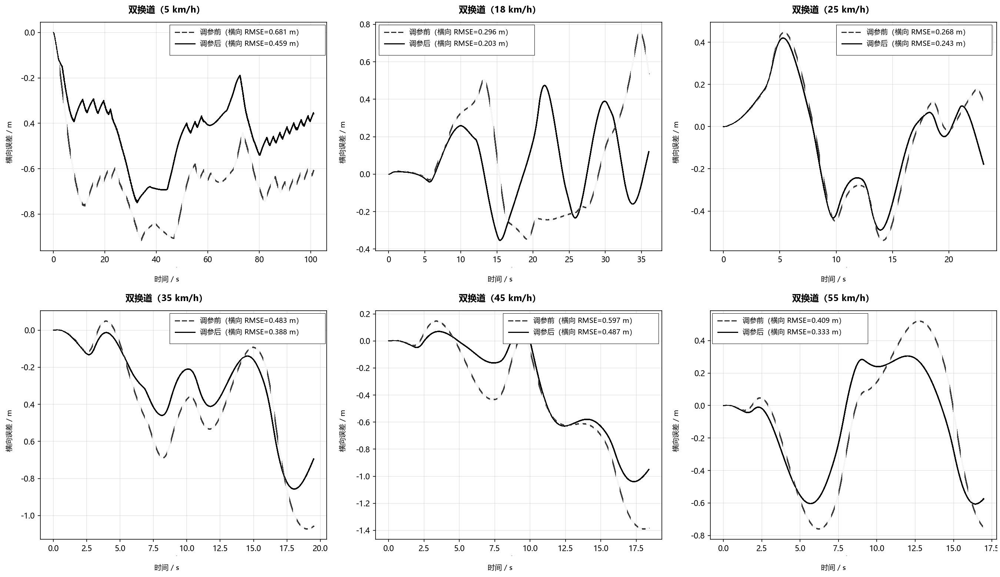

### 6.2 实施例二：车辆物理参数域随机化整定

在另一个实施例中，关闭 MLP 残差增强并采用纯机理被控对象，即 \(\alpha=0\)。每轮训练采样 4 组车辆物理参数，将 48 条轨迹复制到 4 个车辆域，共形成 192 条批量闭环仿真样本。牵引车质量采样范围为名义值的正负 10%，前后轴侧偏刚度采样范围为名义值的正负 20%。

纯机理模型实施例中，综合损失从 2.7083 下降到 1.5639，下降约 42.26%。硬逻辑验证路径中，49 个场景里有 47 个场景横向误差下降，47 个场景航向误差下降；横向误差变化平均值为 -29.32%，航向误差变化平均值为 -24.87%。该实施例说明，通过训练中暴露车辆物理参数不确定性，控制器参数避免仅适配单一名义车辆。

### 6.3 实施例三：叠加反馈噪声和指令抖动的鲁棒整定

在另一个实施例中，启用权重冻结的 MLP 残差增强，即 \(\alpha=1\)，并同时启用车辆参数域随机化、反馈噪声和指令抖动。本次实验的位置噪声标准差为 0.02 m，航向噪声标准差为 0.115°，速度噪声标准差为 0.18 km/h，横摆角速度噪声标准差为 0.002 rad/s，以上噪声均截断于 3 倍标准差；转向指令抖动标准差为 0.0005 rad，扭矩指令抖动标准差为 3 N·m，二者同样截断于 3 倍标准差。

训练结果显示，综合损失从 4.6378 下降到 3.5931，下降约 22.53%。硬逻辑验证路径中，49 个场景里有 43 个场景横向误差下降，33 个场景航向误差下降；横向误差和航向误差变化平均值分别为 -17.61% 和 -5.73%。该结果说明，本发明能够把外部扰动纳入训练环境，同时仍通过无扰动硬逻辑路径评估整定效果。

### 6.4 实施例四：MLP 残差模型可视化诊断

在另一个启用残差增强的实施例中，即 \(\alpha=1\)，系统针对被控对象中的冻结 MLP 残差模型运行可视化诊断。诊断时，系统在不改变控制器主体结构的情况下，分别运行纯机理模型路径、机理模型加完整 MLP 残差路径，以及屏蔽部分 MLP 输出分量的消融路径。每个路径均记录车辆轨迹、横向误差、方向盘命令、MLP 输入特征、归一化输入距离、原始残差输出和限幅后的残差输出。

在静态扫描中，系统向 MLP 残差模型输入无侧向速度、无横摆角速度和无控制激励的基准车辆状态，并扫描纵向速度。若 MLP 在该输入下仍输出随车速持续增长的侧向速度残差，则说明残差模型可能存在无激励偏置。该偏置在 50 Hz 闭环中会被逐步积分放大，使车辆状态偏离参考路径，并诱发控制器进行反向补偿。

在组件消融中，系统可以将 MLP 输出中的牵引车速度残差、挂车速度残差或相对位姿残差分别置零，再重新运行相同场景。若屏蔽某一类残差后，轨迹误差恢复到纯机理模型水平，则可判断失控主要由该类 MLP 残差输出驱动；若纯机理模型和混合模型均存在类似误差，则更可能是控制器参数或控制器结构不足。

图8示出了一个 MLP 残差可视化诊断示例。该示例通过开环静态扫描、闭环输出时序、车辆侧向速度变化、方向盘反应、早期积分偏差、轨迹平面和组件消融结果，把“网络残差偏置被高频闭环积分放大”的过程串联起来。该诊断结果用于辅助判断异常来源，不限定本发明必须采用图中具体场景、网络编号、阈值或显示样式。

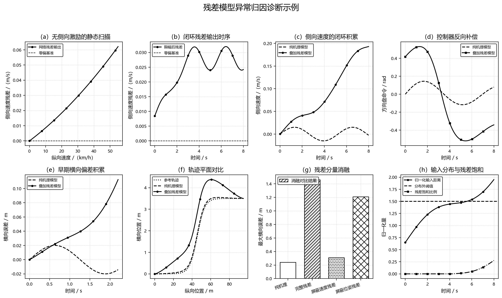

### 6.5 可实施性说明

上述实施例可以采用通用计算设备、仿真服务器或车端开发环境实施。实施时，将车辆横向控制逻辑、纵向控制逻辑、车辆机理动力学模型、训练场景库、参数边界表和验证场景库配置在同一整定系统中；在启用残差增强时，再配置预训练 MLP 残差模型及其诊断阈值。训练完成后，系统输出与原控制器参数格式一致或可转换为原参数格式的整定配置。

在一个可选实施方式中，系统保存每轮训练的参数变化、损失变化、代表场景跟踪曲线、硬逻辑复验统计、MLP 可视化诊断图、输入分布外统计和配置导出日志。上述材料用于说明参数整定过程、复验结果、车辆模型可信度和部署前差异，不限定本发明的具体软件目录、编程语言、配置文件名称或图表样式。
