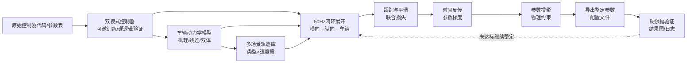
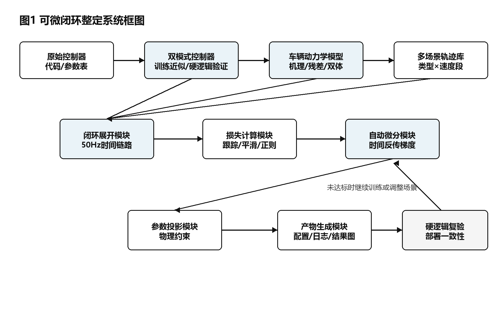
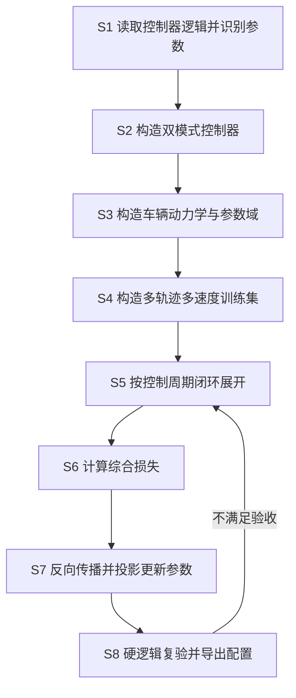
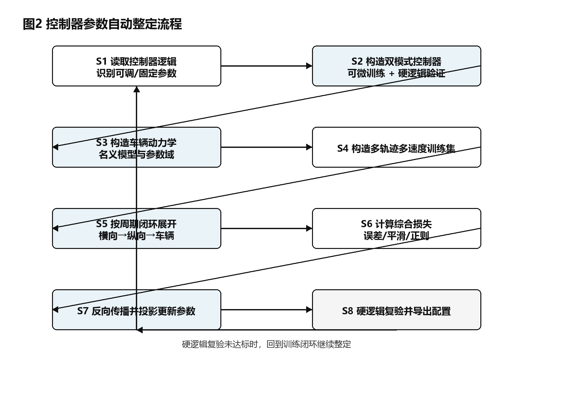
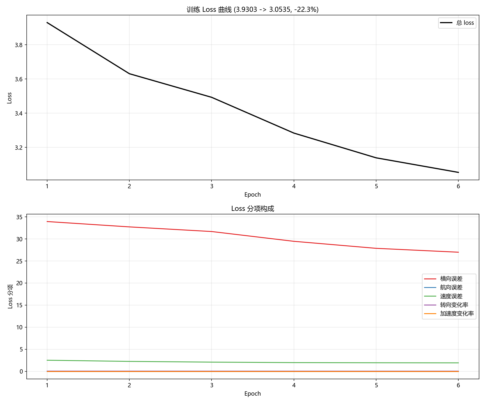
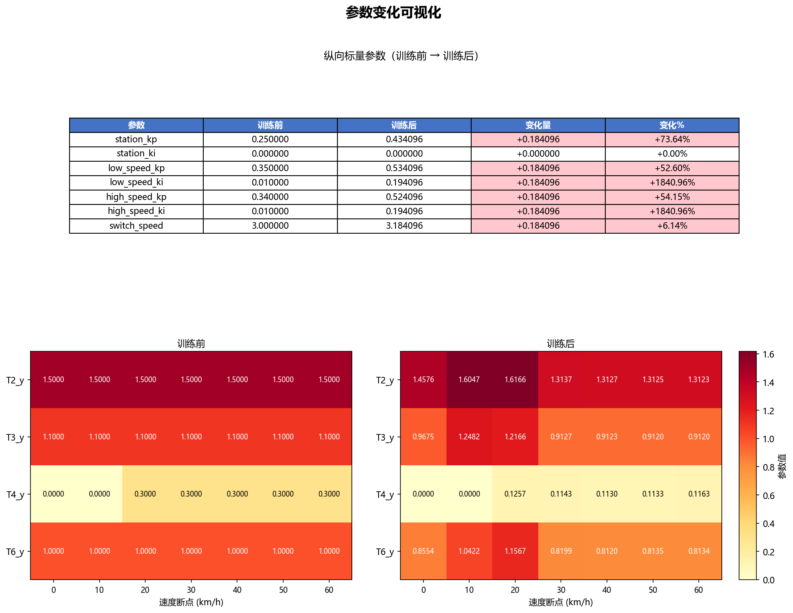
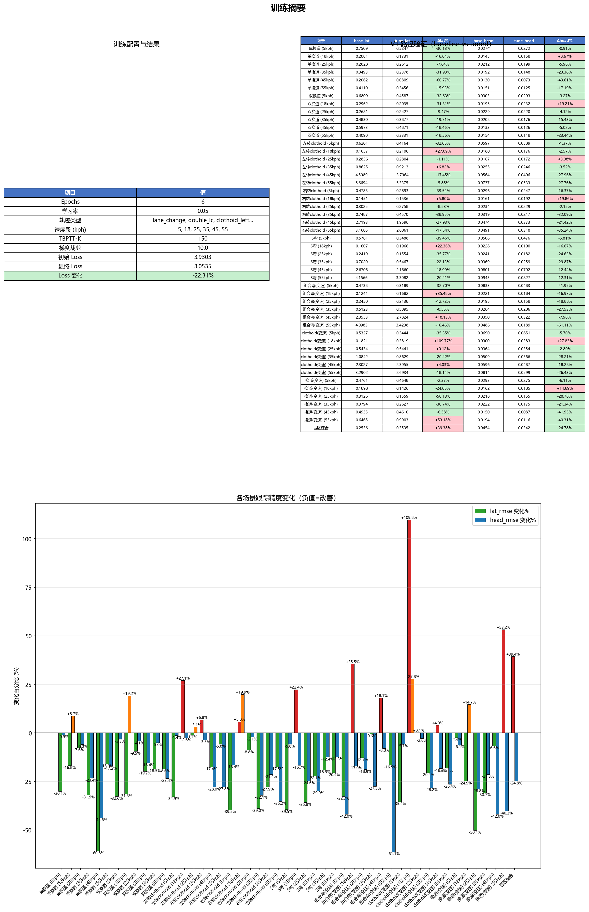
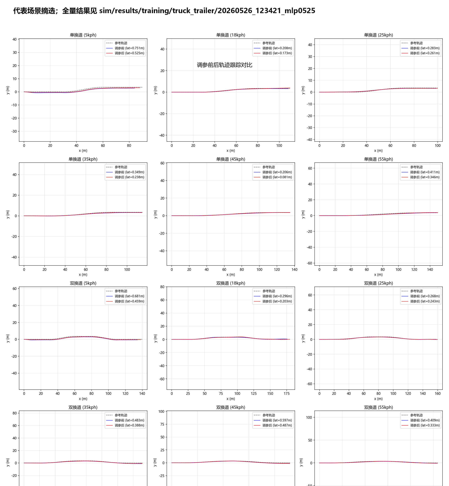
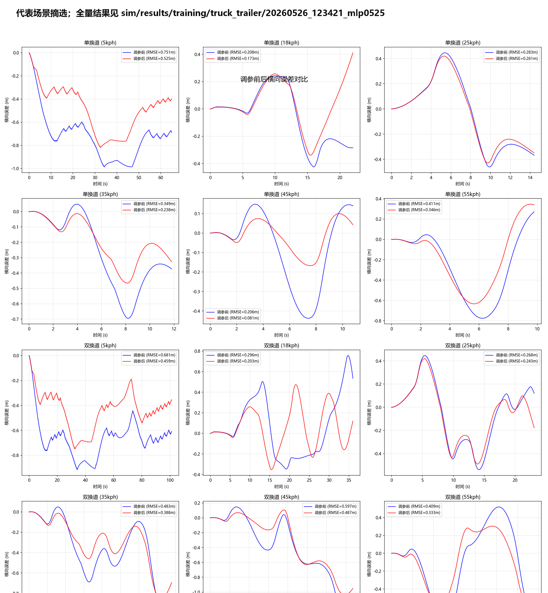

# 技术交底书

**案件名称**：一种基于车辆动力学可微闭环仿真的车辆横纵向控制器参数自动整定方法

**技术联系人**：
- 姓名：[待填写]
- 电话：[待填写]
- 邮箱：[待填写]

**专利类型**：发明

**版本说明**：V2；形成时间：2026-07-09；本版按照中国发明专利技术交底书常用章节结构、查新写法、迭代留档和保护点组织方式，对 V1 进行结构化重写。

---

## 注意事项

（1）交底书应使代理人能够看懂，尤其是背景技术和详细技术方案，应当写得全面、清楚、完整。

（2）技术公开程度应以本领域普通技术人员不需付出创造性劳动即可实施为准。

（3）本交底书中的实施例和参数取值用于说明可实施方式，不作为权利要求保护范围的限定。

## 一、介绍相关技术背景，描述与本发明技术最相近的现有技术，并说明该现有技术存在的缺点

### 1.1 现有技术

检索说明：在 Google Patents、arXiv 及论文公开页面中，以“differentiable controller tuning”“vehicle lateral control calibration”“autonomous driving parameter tuning”“vehicle dynamics model”“auto-differentiation controller tuning”等为检索词进行检索；与本案最接近的公开材料主要集中在可微物理系统、车辆横向控制参数选择、自动驾驶规划器调参、车辆动力学建模和控制器自动调参五个方向。

（1）可微物理系统仿真与控制方向。美国专利公开 [US20220171353A1](https://patents.google.com/patent/US20220171353A1/en) 公开了面向物理系统的可微机器，用于对物理系统进行仿真或控制。该方向说明了“将物理系统做成可微计算对象”的通用思想，但其重点是通用物理系统的可微机器框架，并未针对自动驾驶车辆的横纵向串行控制器、工程限幅逻辑、轨迹查询和硬逻辑复验给出闭环参数整定流程。

（2）车辆横向控制参数动态选择方向。美国专利 [US11731648B2](https://patents.google.com/patent/US11731648B2/en) 公开了车辆横向控制特征的动态可调标定方案，其根据天气、图像和车辆状态等信息选择横向调谐参数，以降低车道中心线误差或转向振荡。该方案属于运行时按工况选择或切换预定参数的思路，重点是根据外部环境和车辆状态选择已有标定，并未公开通过车辆动力学闭环时间链路对横向和纵向控制器参数自动求梯度、自动更新和硬逻辑复验。

（3）自动驾驶规划器参数自动调节方向。美国专利公开 [US20230159047A1](https://patents.google.com/patent/US20230159047A1/en) 及其同族中国公开 [CN115907250A](https://patents.google.com/patent/CN115907250A/en) 公开了基于学习型评价器调节自动驾驶车辆运动规划器的方法。该方案使用学习型评价器构建目标函数并优化规划器参数，适用于运动规划层参数调节；本案关注低层车辆横纵向控制器参数，尤其是工程控制器中的查找表、预瞄时间、速度环增益、硬限幅和速率限制等逻辑，且训练后必须回到原始硬逻辑验证路径。

（4）神经网络车辆动力学模型方向。美国专利 [US12007778B2](https://patents.google.com/patent/US12007778B2/en) 公开了基于神经网络的车辆动力学模型，用历史驾驶数据预测车辆加速度或扭矩，用于提高自动驾驶仿真结果的准确性。该方向解决的是被控对象建模精度问题，并未说明如何把车辆动力学、控制器、轨迹查询和损失函数组成可反传的闭环链路，也未公开可调控制器参数的分类、投影和硬逻辑部署一致性验证。

（5）控制器自动微分调参方向。论文 [DiffTune: Auto-Tuning through Auto-Differentiation](https://arxiv.org/abs/2209.10021) 将控制器调参表述为参数优化问题，把动力学系统和控制器展开成计算图，并用梯度方法更新控制器参数。该方向与本案在“闭环展开并利用梯度调参”上较接近，但其公开对象主要为机器人系统中的可微动力学和控制器，不针对自动驾驶工程控制器中的最近点选择、条件分支、查找表、硬限幅、硬速率限制、横纵向串行控制和训练/验证双路径一致性问题。

综合上述检索结果，现有技术或者关注通用可微物理系统，或者关注车辆工况下的参数选择，或者关注规划器调参和动力学模型建模。它们尚未公开一种将真实车辆横纵向工程控制器、车辆动力学、多轨迹多速度场景、非光滑工程逻辑可微处理、物理约束参数投影和硬逻辑复验组合为统一闭环整定流程的方法。

### 1.2 现有技术存在的缺点

第一，现有车辆控制标定方案多依赖人工经验或预先标定的参数表，难以根据多场景跟踪误差自动给出参数更新方向。

第二，已有可微调参方案通常假设动力学和控制器天然可微，难以直接处理工程控制器中的最近点选择、条件分支、硬限幅、速率限制和查找表等非光滑逻辑。

第三，已有自动驾驶参数调节多集中在规划层或单一横向控制特征，缺少面向横向和纵向控制器耦合闭环的统一调参方式。

第四，单一名义车辆模型上的参数优化容易过拟合，难以覆盖车辆质量、侧偏刚度、反馈噪声和执行器抖动等实车不确定性。

第五，训练近似路径和工程部署路径之间可能存在行为差异，若缺少硬逻辑复验，调出的参数可能只在训练近似中有效。

## 二、针对上述缺点，说明本发明所要解决的技术问题

本发明所要解决的技术问题是：如何在保留车辆工程控制器物理含义和部署约束的前提下，将横向控制器、纵向控制器、车辆动力学和多场景评价指标连接为可自动求梯度的闭环时间链路，使控制器参数能够自动整定，并在整定后通过原始硬逻辑进行复验。

具体包括以下问题：

（1）如何将含查找表、条件分支、限幅和速率限制的工程控制器改造成训练时可回传梯度、验证时仍能保持工程行为的双模式控制器。

（2）如何在横向控制器、纵向控制器和车辆动力学串行闭环中同时整定预瞄参数、反馈增益和速度切换参数，减少人工试验。

（3）如何在多轨迹、多速度段和多车辆参数域中批量训练，使整定参数具有鲁棒性。

（4）如何将整定结果导出为工程配置，并用硬分支、硬限幅和硬速率限制验证部署一致性。

## 三、本发明技术方案的详细阐述

### 3.1 背景

本发明面向自动驾驶车辆控制模块。控制模块以固定周期运行，参考轨迹和参考速度由上游规划模块给出，横向控制器根据车辆位置、航向和轨迹几何关系生成转向指令，纵向控制器根据速度误差和站位误差生成加速度或驱动扭矩，车辆动力学模型根据控制指令更新车辆状态。

在工程控制器中，横向部分通常包含预瞄时间、曲率前馈、横向误差反馈、航向误差反馈、查找表和转向速率限制；纵向部分通常包含站位环、速度环、低高速切换、积分环节、加速度包络和扭矩输出层。这些参数互相耦合，且在不同轨迹、速度和车辆参数下表现不同。

本发明将上述闭环系统展开为时间序列计算链路，并将控制器参数作为待优化变量。训练阶段通过可微近似或直通估计处理非光滑工程逻辑，使综合损失可以对控制器参数求梯度；验证阶段恢复原始硬逻辑，以确认整定参数在真实工程行为下仍然有效。

### 3.2 系统框图

图1示出了本发明的一种系统组成。系统包括原始控制器代码/参数表、双模式控制器、车辆动力学模型、多场景轨迹库、闭环展开模块、损失计算模块、自动微分模块、参数投影模块、产物生成模块和硬逻辑复验模块。各模块之间形成从工程控制器复现、闭环仿真、参数更新到部署验证的闭环流程。

<!--  -->

### 3.3 模块功能说明

（1）原始控制器代码/参数表用于提供待复现的横向和纵向工程控制逻辑，并给出初始标定参数、车辆物理常数和安全边界。

（2）双模式控制器用于在训练模式下提供可微计算路径，在验证模式下提供与工程控制器一致的硬逻辑路径。同一组整定参数在两个模式中共享。

（3）车辆动力学模型用于将转向、加速度或扭矩等控制指令转化为车辆状态变化。车辆动力学模型可以采用运动学自行车模型、动力学自行车模型、机理模型与残差模型组合，或牵引车与挂车双体模型。

（4）多场景轨迹库用于提供换道、双换道、渐变曲率弯道、S弯、弯前减速和换道加减速等场景，并覆盖多个速度段。

（5）闭环展开模块用于按控制周期串联横向控制器、纵向控制器和车辆动力学模型，使每一时刻的状态变化都依赖前一时刻的控制结果。

（6）损失计算模块用于评价横向误差、航向误差、速度误差、转向平滑性、加速度平滑性和参数偏移，得到可优化的综合损失。

（7）自动微分模块用于沿闭环时间链路计算综合损失对控制器参数的梯度。

（8）参数投影模块用于将更新后的参数限制在预设物理范围、安全范围和工程可部署范围内。

（9）产物生成模块用于输出整定后的配置文件、训练日志、参数变化图和调参前后对比图。

（10）硬逻辑复验模块用于使用原始硬分支、硬限幅和硬速率限制重新运行全场景仿真，验证整定参数是否满足部署一致性要求。

### 3.4 系统流程说明

图2示出了本发明的一种方法流程。

<!--  -->

具体流程如下：

S1，读取车辆控制器的原始代码和参数配置，识别可调参数、固定物理参数和安全约束参数。

S2，将横向控制器和纵向控制器封装为双模式控制器。训练模式保留控制器主要物理关系，并对非光滑步骤采用可微近似；验证模式保留原始工程硬逻辑。

S3，构建车辆动力学模型，并根据需要构建车辆物理参数域。物理参数域可包括牵引车质量、前轴侧偏刚度、后轴侧偏刚度和挂车相关参数。

S4，构造多轨迹多速度训练集，并将轨迹场景、速度段和车辆参数域展开为批量样本。

S5，在每一个控制周期内，按横向控制、纵向控制和车辆动力学更新的顺序推进闭环状态。

S6，根据车辆状态和参考轨迹计算综合损失。

S7，沿时间展开链路反向传播，获得损失对控制器参数的梯度，更新参数并执行物理约束投影。

S8，导出整定后的参数配置，并在验证模式下进行硬逻辑复验；若复验不满足要求，则以上一轮参数为起点继续整定或调整训练场景。

### 3.4.1 符号与公式

#### （1）符号与变量定义

| 符号 | 含义 | 下标/量纲 |
|------|------|-----------|
| \(t\) | 控制周期索引 | \(t=0,1,\ldots,T\)，周期可为 0.02 s |
| \(x_t\) | 第 \(t\) 个周期的车辆状态 | 包括位置、航向、速度、横摆角速度等 |
| \(r_t\) | 第 \(t\) 个周期查询到的参考轨迹状态 | 包括参考位置、航向、曲率和速度 |
| \(u_t\) | 第 \(t\) 个周期的控制指令 | 包括转向、加速度或扭矩 |
| \(\theta\) | 待整定控制器参数集合 | 含横向参数 \(\theta_{\mathrm{lat}}\) 与纵向参数 \(\theta_{\mathrm{lon}}\) |
| \(\phi\) | 车辆动力学参数集合 | 质量、侧偏刚度、轮胎半径等 |
| \(e_{t,\mathrm{lat}}\) | 横向跟踪误差 | 单位 m |
| \(e_{t,\mathrm{head}}\) | 航向误差 | 单位 rad |
| \(e_{t,\mathrm{spd}}\) | 速度误差 | 单位 m/s |
| \(\Delta u_t\) | 相邻周期控制指令变化 | 用于平滑性约束 |
| \(J(\theta)\) | 综合损失函数 | 无量纲或按归一化后加权 |
| \(\Pi_{\Theta}(\cdot)\) | 参数投影算子 | 将参数限制在集合 \(\Theta\) 内 |

#### （2）闭环状态更新

控制器和车辆动力学在每一周期形成如下关系。公式（1）为控制器映射：

\[
u_t = g(x_t,r_t,\theta)
\]

公式（2）为车辆动力学更新：

\[
x_{t+1} = f(x_t,u_t,\phi)
\]

其中，\(g(\cdot)\) 表示双模式控制器在训练路径中的可微形式，\(f(\cdot)\) 表示车辆动力学模型。由于 \(x_{t+1}\) 依赖 \(u_t\)，而 \(u_t\) 依赖 \(\theta\)，因此多周期跟踪误差可以沿时间链路对 \(\theta\) 求梯度。

#### （3）综合损失

训练阶段可采用如下综合损失。公式（3）为多目标加权损失：

\[
J(\theta)=\sum_{t=0}^T\left(w_{\mathrm{lat}}e_{t,\mathrm{lat}}^2+w_{\mathrm{head}}e_{t,\mathrm{head}}^2+w_{\mathrm{spd}}e_{t,\mathrm{spd}}^2+w_{\mathrm{smooth}}\|\Delta u_t\|^2\right)+w_{\mathrm{reg}}\|\theta-\theta_0\|^2
\]

其中 \(\theta_0\) 为初始工程标定参数。上述损失可以按轨迹长度、速度段和车辆参数域进行归一化，避免长轨迹或高误差场景支配训练。

#### （4）参数更新与硬逻辑复验

参数更新可表示为公式（4）：

\[
\theta^{k+1}=\Pi_{\Theta}\left(\theta^k-\eta\nabla_\theta J(\theta^k)\right)
\]

训练结束得到 \(\theta^*\) 后，将其放入验证模式，如公式（5）：

\[
M_{\mathrm{hard}}(\theta^*) \rightarrow \{\mathrm{trajectory},\mathrm{error},\mathrm{command},\mathrm{log}\}
\]

式 (5) 表示用原始硬分支、硬限幅和硬速率限制运行全场景验证，并输出轨迹、误差、控制指令和日志。只有当验证结果满足预设要求时，整定参数才作为可部署配置输出。

### 3.5 关键技术参数

| 符号或类别 | 示例参数 | 取值或约束 | 可调性 | 说明 |
|------------|----------|------------|--------|------|
| \(\theta_{\mathrm{lat}}\) | 横向预瞄时间、收敛时间、角速度误差预瞄时间、远预瞄时间查找表节点 | 受速度段和转向稳定性约束 | 可调 | 对应横向控制器跟踪精度和转向平滑性 |
| \(\theta_{\mathrm{lon}}\) | 站位环增益、低速速度环增益、高速速度环增益、低高速切换速度 | 增益非负，切换速度位于工程范围内 | 可调 | 对应速度跟踪和加减速响应 |
| \(\phi\) | 质量、前后轴侧偏刚度、轮胎半径、传动效率 | 名义值或采样范围 | 固定或采样 | 用于车辆动力学与域随机化 |
| \(w_{\mathrm{lat}},w_{\mathrm{head}},w_{\mathrm{spd}}\) | 跟踪误差权重 | 正数 | 预设 | 用于平衡横向、航向和速度目标 |
| \(w_{\mathrm{smooth}}\) | 控制指令平滑权重 | 正数 | 预设 | 用于抑制转向和加速度突变 |
| \(\Pi_{\Theta}\) | 参数投影范围 | 上下界由车辆物理和安全约束确定 | 固定 | 防止自动更新越过可部署范围 |

## 四、与现有技术相比，本发明具有哪些优点？

第一，本发明将车辆横向控制器、纵向控制器、车辆动力学和评价指标统一到闭环时间链路中，使参数更新方向来自多周期跟踪误差，而不是依赖人工逐项试验。

第二，本发明采用训练模式和验证模式共享参数的双模式控制器，训练模式解决梯度回传问题，验证模式保留原始硬逻辑，从而降低训练近似与工程部署行为不一致的风险。

第三，本发明针对查找表、限幅、速率限制、条件分支和最近点选择等工程非光滑逻辑给出组合处理方式，使真实工程控制器可以被纳入可微整定流程。

第四，本发明将轨迹类型、速度段和车辆物理参数域展开为批量样本，可以在一次训练中同时覆盖多场景和多车辆状态，提高整定参数的鲁棒性。

第五，本发明整定后自动生成配置文件、训练曲线、参数变化图、轨迹对比图和硬逻辑验证日志，便于工程复核和后续部署。

## 五、本发明的技术关键点和欲保护点是什么？

（1）一种车辆横纵向控制器闭环可微参数整定方法：将轨迹查询、横向控制器、纵向控制器、车辆动力学和损失函数按控制周期展开，基于综合损失对控制器参数自动求梯度并更新。

（2）一种双模式控制器复现方法：同一组控制器参数在训练模式下采用可微处理，在验证模式下采用原始硬分支、硬限幅和硬速率限制，以兼顾训练可行性和工程一致性。

（3）一种工程非光滑逻辑的可微处理组合：包括查找表线性插值、速率限制直通估计、条件分支平滑混合、最近点选择隔离、时间预瞄插值和参数范围投影。

（4）一种横向和纵向控制器参数联合分类整定方法：将预瞄时间、收敛时间、控制增益和切换速度作为可调参数，将车辆物理常数、安全边界和监控参数作为固定参数或车辆域样本，避免把不可部署或不应学习的量误作为整定对象。

（5）一种多轨迹、多速度段、多车辆参数域的批量鲁棒整定方法：将轨迹和车辆物理参数域展开为批量样本，同步推进闭环仿真并按场景归一化损失。

（6）一种训练后硬逻辑复验与产物生成方法：将整定参数导出为工程配置，并自动生成损失曲线、参数变化、轨迹对比、误差对比和验证日志；若硬逻辑复验不满足要求，则继续闭环整定。

（7）上述方法在牵引车与挂车双体动力学模型、机理模型与残差模型组合以及低层车辆控制器可微复现中的应用。

（8）一种实现上述方法的系统，包括控制器双模式复现模块、车辆动力学模块、轨迹库模块、闭环展开模块、损失计算模块、自动微分模块、参数投影模块、硬逻辑复验模块和产物生成模块。

（9）一种计算机可读存储介质，其上存储的程序被执行时实现上述车辆横纵向控制器参数自动整定方法。

## 六、其它（实施例、技术效果、参数示例）

### 6.1 实施例一：基于牵引车动力学和残差模型的闭环整定

在一个实施例中，被控对象为牵引车动力学模型，车辆动力学采用机理模型和冻结的残差模型组合。控制器为横向多点预瞄控制器和纵向级联控制器，控制周期为 50Hz，训练轨迹为 8 类轨迹和 6 个速度段，共 48 条训练轨迹。训练轮数为 6，时间截断窗口为 150 步。

训练结果显示，综合损失从 3.9303 下降到 3.0535，下降约 22.31%。使用硬逻辑验证路径在 49 个场景中对比调参前后表现，其中 38 个场景横向误差均方根下降，43 个场景航向误差均方根下降；横向误差变化的平均值为 -11.20%，航向误差变化的平均值为 -15.11%。

参数变化显示，横向 4 组查找表均发生非零调整；纵向低速和高速速度环增益、站位环增益和切换速度也发生调整。该结果说明，损失能够同时穿过横向预瞄、纵向速度环和车辆动力学链路回到控制器参数。

图3示出了训练损失曲线。

图4示出了调参前后控制器参数变化。

图5示出了训练摘要和硬逻辑验证统计。

图6和图7示出了代表场景的轨迹跟踪和横向误差对比；完整结果保留在项目结果目录中。

### 6.2 实施例二：车辆物理参数域随机化整定

在另一个实施例中，每轮训练采样 4 组车辆物理参数，将 48 条轨迹复制到 4 个车辆域，共形成 192 条批量闭环仿真样本。牵引车质量采样范围为名义值的正负 10%，前后轴侧偏刚度采样范围为名义值的正负 20%。

纯机理模型实施例中，综合损失从 2.7083 下降到 1.5639，下降约 42.26%。硬逻辑验证路径中，49 个场景里有 47 个场景横向误差下降，47 个场景航向误差下降；横向误差变化平均值为 -29.32%，航向误差变化平均值为 -24.87%。该实施例说明，通过训练中暴露车辆物理参数不确定性，控制器参数不是只适配单一名义车辆。

### 6.3 实施例三：叠加反馈噪声和指令抖动的鲁棒整定

在另一个实施例中，车辆参数域随机化与反馈噪声、指令抖动同时启用。反馈噪声作用在位置、航向、速度和横摆角速度等控制器输入上，指令抖动作用在转向和扭矩执行指令上。

训练结果显示，综合损失从 4.6378 下降到 3.5931，下降约 22.53%。硬逻辑验证路径中，49 个场景里有 43 个场景横向误差下降，33 个场景航向误差下降；横向误差变化平均值为 -17.61%。该结果说明，本发明能够把外部扰动纳入训练环境，同时仍通过无扰动硬逻辑路径评估整定效果。

### 6.4 项目实现依据

控制器复现和参数分类可参考项目文件：`sim/controller/lat_truck.py`、`sim/controller/lon.py`、`docs/tunable_params_analysis.md`。

闭环仿真和双路径验证可参考项目文件：`sim/sim_loop.py`、`sim/common.py`、`sim/optim/post_training.py`。

批量并行训练、域随机化、反馈噪声和指令抖动可参考项目文件：`sim/optim/train_batch.py`、`docs/plans/2026-05-08-domain-randomization-design.md`、`docs/plans/2026-05-08-aggressive-dr-noise-dither-design.md`。

实验结果图和日志可参考项目目录：`sim/results/training/truck_trailer/20260526_123421_mlp0525`、`sim/results/training/truck_trailer/20260508_133208_nomlp_dr`、`sim/results/training/truck_trailer/20260509_181719_mlp0509_dr+noise+dither`。
