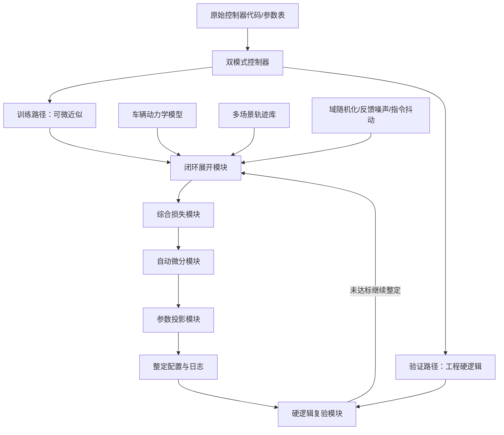
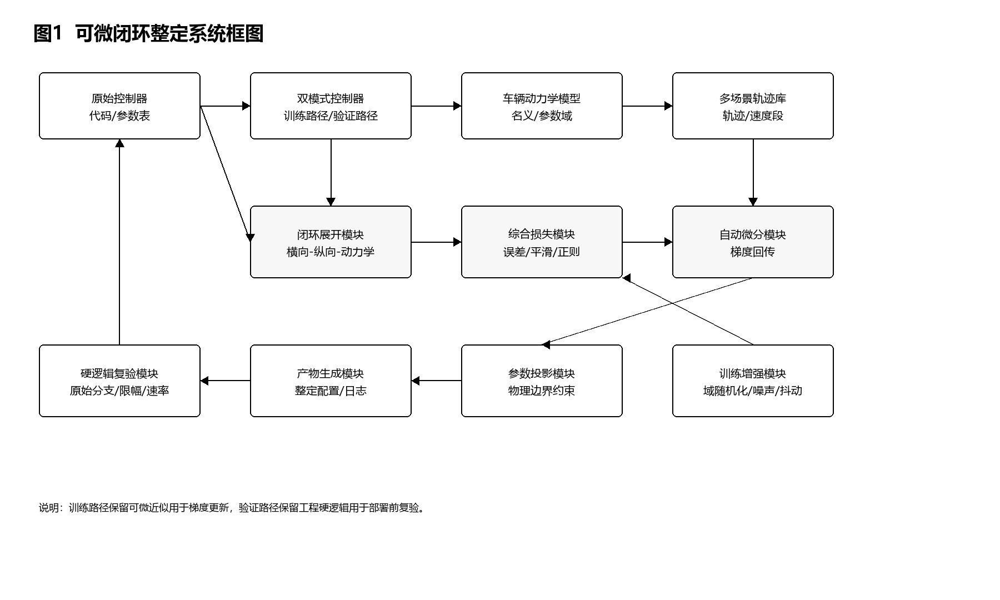
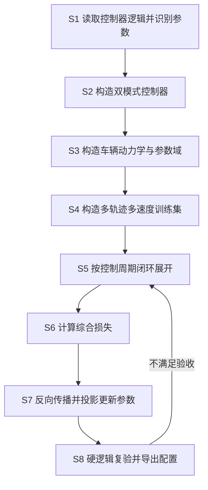
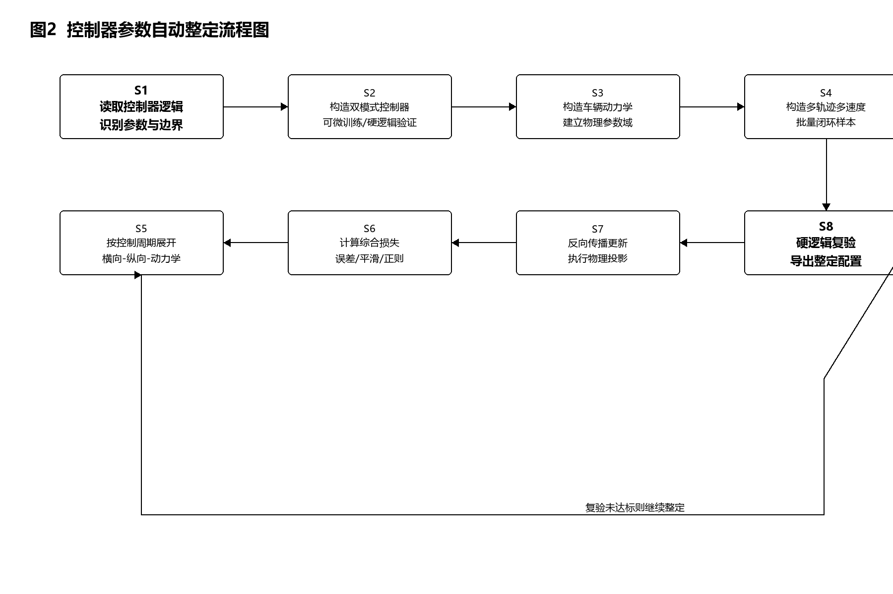
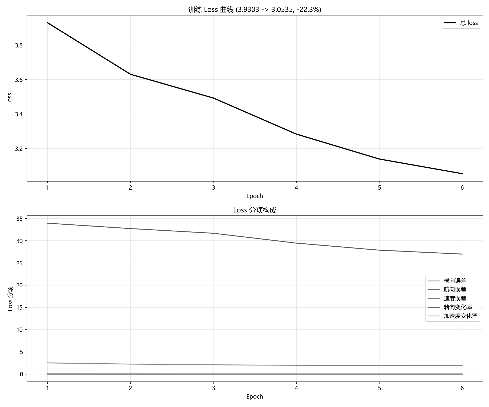
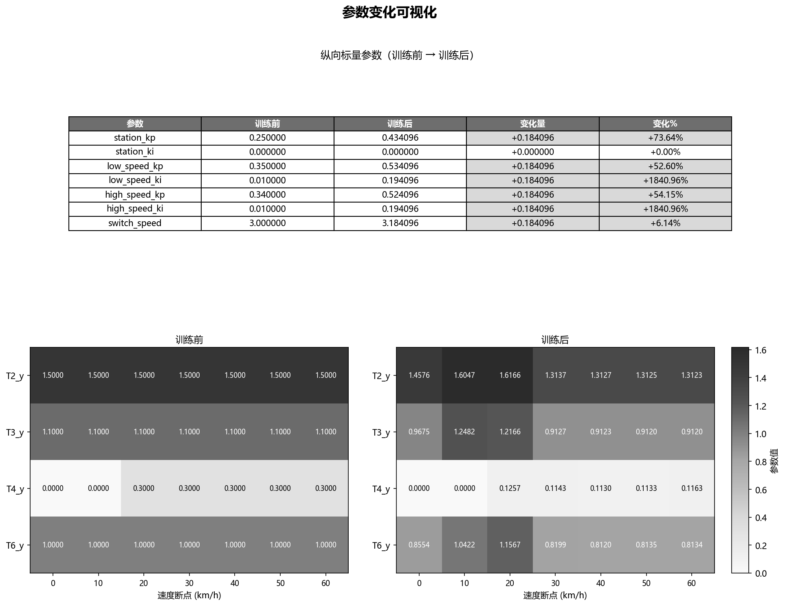
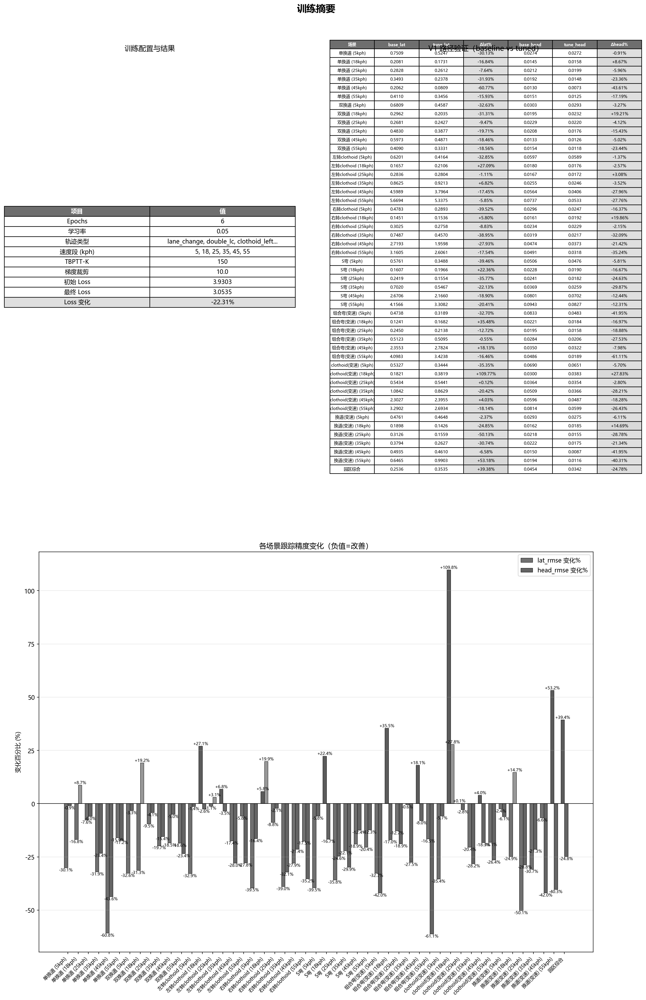
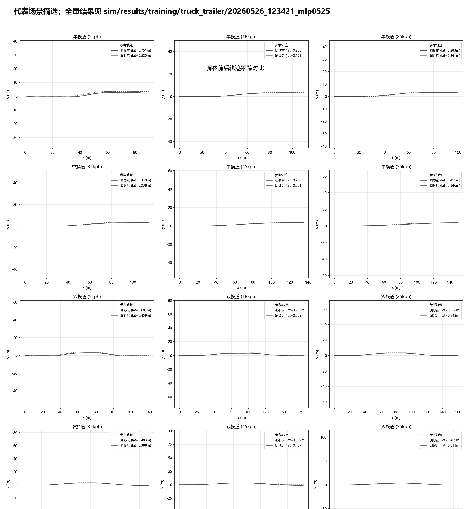
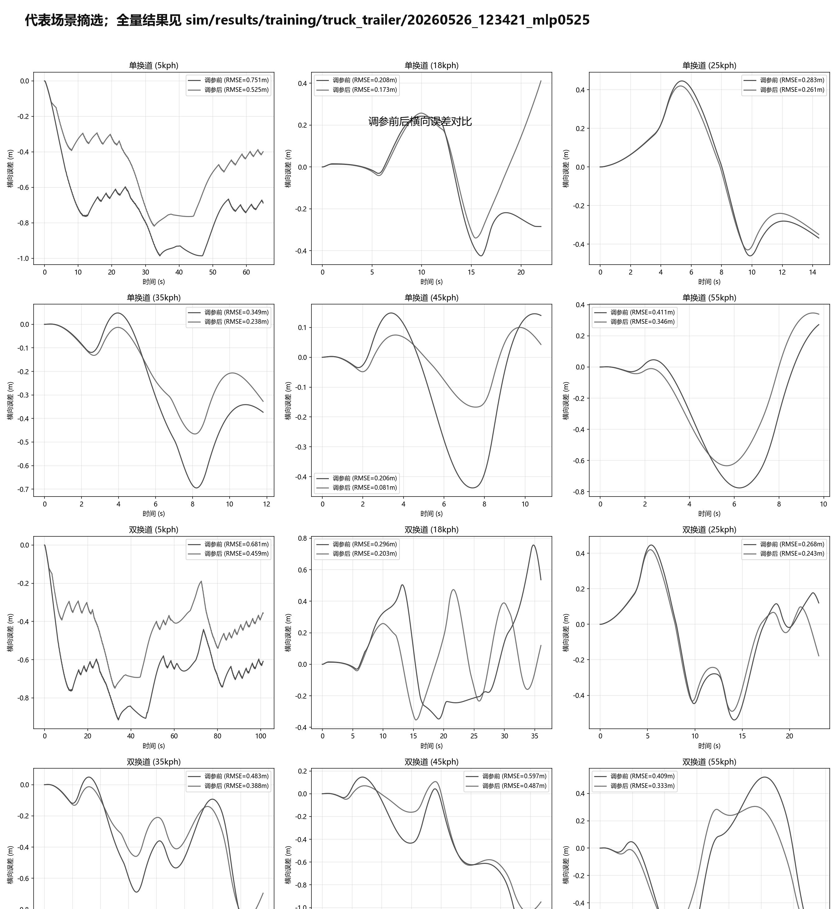

# 技术交底书

**案件名称**：一种基于车辆动力学可微闭环仿真的车辆横纵向控制器参数自动整定方法

**技术联系人**：
- 姓名：[待填写]
- 电话：[待填写]
- 邮箱：[待填写]

**专利类型**：发明

**版本说明**：V3；形成时间：2026-07-09；本版在 V2 基础上补充国家知识产权局专利公布公告系统查新结果，并将 Word 版调整为黑白正式排版和原生数学公式呈现。

---

## 注意事项

（1）交底书应使代理人能够看懂，尤其是背景技术和详细技术方案，应当写得全面、清楚、完整。

（2）技术公开程度应以本领域普通技术人员不需付出创造性劳动即可实施为准。

（3）本交底书中的实施例和参数取值用于说明可实施方式，不作为权利要求保护范围的限定。

## 一、介绍相关技术背景，描述与本发明技术最相近的现有技术，并说明该现有技术存在的缺点

### 1.1 现有技术

检索说明：在国家知识产权局专利公布公告系统、Google Patents 和 arXiv 公开页面中，以“可微控制”“可微仿真”“车辆控制器标定”“车辆动力学模型”“车辆横向控制参数”“车辆纵向控制参数”“车辆横纵向控制”“闭环仿真”等为检索词进行检索；部分海外公开文献和论文以 Google Patents 或 arXiv 页面复核著录项。与本案最接近的公开材料主要集中在车辆横向控制参数调节、车辆纵向控制参数优化、车辆横纵向控制、车辆控制器标定、可微仿真训练和通用控制器自动调参六个方向。

（1）车辆横向控制参数调节方向。中国专利公开 [CN119734760A](http://epub.cnipa.gov.cn/patent/CN119734760A) 公开了一种车辆横向控制参数调节方法及系统，其通过实时检测车辆轨迹偏差，分析车辆动态状态与道路环境，计算前馈与 LQR 转角指数，并综合约束调整方向盘角度。该方案强调运行过程中的偏差检测和横向控制执行，适用于复杂路段、弯道或突发环境变化下的横向偏差动态调节，但其核心仍是实时横向控制参数调整，并未公开把工程横向控制器参数作为待优化变量放入多轨迹、多速度车辆动力学闭环中进行反向传播整定。

中国专利公开 [CN119270808A](http://epub.cnipa.gov.cn/patent/CN119270808A) 公开了一种车辆横向控制算法稳定性测试方法及系统，其通过对车道线拟合系数加入正弦干扰，观察车辆横向轨迹并据此优化横向控制参数。该方案提高了横向控制算法稳定性测试的可实施性和测试效率，但其重点是干扰测试和稳定性验证，并未形成可微闭环仿真、自动梯度更新和硬逻辑复验一体化的整定流程。

中国专利公开 [CN118062031A](http://epub.cnipa.gov.cn/patent/CN118062031A) 公开了一种车辆横向控制参数调节方法，其根据速度和向心加速度查询二维增益表，得到目标增益，再调节横向控制器约束参数。该方案能够改善高速变曲率工况下的稳定性，但其参数来源依赖预设二维增益表和在线查表调节，并未公开通过车辆动力学时间展开链路对参数表节点、预瞄参数和纵向参数进行统一自动整定。

（2）车辆纵向控制参数优化方向。中国专利公开 [CN120517441A](http://epub.cnipa.gov.cn/patent/CN120517441A) 公开了一种基于载重辨识的车辆纵向控制参数优化方法及装置，其基于牛顿第二定律构建纵向动力学模型，根据期望加速度和实际加速度更新载重量，再利用更新后的载重值优化油门控制量和刹车控制量。该方案适合解决载重变化导致的纵向控制偏差，属于在线载重辨识与油门、制动控制量修正，尚未公开横向和纵向工程控制器参数的批量闭环可微整定，也未涉及验证路径保留原始硬逻辑的问题。

中国专利公开 [CN118560523A](http://epub.cnipa.gov.cn/patent/CN118560523A) 公开了一种自动驾驶车辆纵向控制方法，其使用预训练车辆纵向控制模型根据本车和前车行驶参数输出加速度，用于模拟驾驶员纵向驾驶风格。该方案强调驾驶风格学习和实时纵向控制输出，并非面向既有工程控制器参数的离线或半离线自动整定。

（3）车辆横纵向控制和车辆动力学模型方向。中国专利公开 [CN120308157A](http://epub.cnipa.gov.cn/patent/CN120308157A) 公开了一种基于道路边界约束的车辆横纵向控制方法及装置，其构建非线性数学模型并线性化为状态转移模型，利用约束迭代线性二次调节器求解控制变量序列，再生成车辆控制指令。该方案重点是基于道路边界约束求解控制量序列以跟踪轨迹，属于控制律求解或轨迹控制层面的优化，并未公开针对既有横向、纵向控制器标定参数的可微仿真环境搭建、参数投影更新和部署前硬逻辑复验。

中国专利公开 [CN122323981A](http://epub.cnipa.gov.cn/patent/CN122323981A) 公开了一种角模块车辆爆胎稳定性控制方法，其根据爆胎车轮位置更新等效侧偏刚度，建立二自由度车辆动力学模型，并通过零和博弈控制和纵向力分配维持车辆稳定。该方案说明车辆动力学模型可用于特殊工况稳定控制，但其应用目标是爆胎后的附加横摆力矩和纵向力分配，并非普通自动驾驶控制器参数的多场景可微整定。

（4）车辆控制器标定设备方向。中国专利公开 [CN112039742A](http://epub.cnipa.gov.cn/patent/CN112039742A) 公开了一种标定设备、车辆控制器标定方法及装置，利用处理器、存储器、CAN 收发器、提示器和通信接口发送标定指令并接收车辆控制器响应，从而简化标定操作。该方案解决的是标定设备和通信流程便利性问题，并未公开如何根据轨迹跟踪误差自动计算参数梯度，也未公开训练路径与验证路径分离的控制器复现结构。

（5）可微仿真训练方向。中国专利公开 [CN122018327A](http://epub.cnipa.gov.cn/patent/CN122018327A) 公开了一种多旋翼无人机容错飞行控制方法，其构建可微仿真环境，在其中训练端到端控制网络，并通过随时间反向传播优化网络参数。中国专利公开 [CN121455178A](http://epub.cnipa.gov.cn/patent/CN121455178A) 公开了一种分布式无人机集群控制系统策略优化方法，其通过可微仿真实现无人机视觉端到端避障策略训练。这些方案表明可微仿真可用于端到端网络策略学习，但其优化对象是神经网络策略或无人机控制网络，并非从已有车辆工程控制器中识别可调标定参数、保留硬限幅和硬分支并输出可部署 YAML 参数配置。

（6）海外公开文献和控制器调参方向。美国专利公开 [US20220171353A1](https://patents.google.com/patent/US20220171353A1/en) 公开了面向物理系统的可微机器，用于仿真或控制物理系统。美国专利 [US11731648B2](https://patents.google.com/patent/US11731648B2/en) 公开了车辆横向控制特征的动态可调标定方案，根据天气、图像和车辆状态等信息选择横向调谐参数。美国专利公开 [US20230159047A1](https://patents.google.com/patent/US20230159047A1/en) 及同族 [CN115907250A](https://patents.google.com/patent/CN115907250A/en) 公开了利用学习型评价器对自动驾驶运动规划器参数进行自动调节。美国专利 [US12007778B2](https://patents.google.com/patent/US12007778B2/en) 公开了基于神经网络的车辆动力学模型，用于预测车辆状态量。论文 [DiffTune: Auto-Tuning through Auto-Differentiation](https://arxiv.org/abs/2209.10021) 将控制器调参表述为动态系统和控制器展开后的参数优化问题。这些公开材料分别涉及通用可微物理系统、横向标定选择、规划器参数调节、神经动力学建模或控制器自动调参，但均未同时公开本案中的车辆横纵向工程控制器双模式复现、车辆动力学闭环展开、批量场景域随机化、可微参数投影更新、以及原始硬逻辑复验后导出可部署参数的完整组合。

检索总结：现有技术已经公开了若干车辆横向控制参数调节、纵向控制量优化、车辆动力学模型控制、标定设备、可微仿真训练以及控制器自动调参方案，但这些方案通常只解决单一控制方向、单一运行时调节、标定通信便利、端到端网络训练或规划器调参问题。本发明的本质区别在于：把已有车辆横向和纵向工程控制器复现为训练路径与验证路径共用参数的双模式控制器，利用车辆动力学模型把控制器、轨迹查询、车辆状态更新和损失函数连成可微闭环时间链路，并在多轨迹、多速度、车辆参数域和扰动条件下自动更新控制器参数，最后通过保留工程硬逻辑的验证路径输出可部署参数。

### 1.2 现有技术存在的缺点

（1）现有车辆横向控制参数调节方案多为在线查表、按偏差动态调节或稳定性测试后优化，难以一次性利用多轨迹、多速度和多车辆参数域数据对整组控制器参数进行全局整定。

（2）现有纵向控制优化方案多围绕载重辨识、驾驶风格学习或油门/制动控制量修正展开，未与横向控制器参数、轨迹跟踪误差和车辆动力学闭环统一建模。

（3）现有车辆动力学控制方案常用于轨迹控制量求解、稳定控制或特殊工况处置，优化对象通常是控制量序列或附加力矩，而不是已有工程控制器内部标定参数。

（4）现有标定设备方案关注通信、指令下发和人工标定流程便利性，无法自动给出参数梯度、参数更新方向和部署前闭环验证结果。

（5）现有可微仿真训练方案多用于端到端神经网络策略，若直接用于工程车辆控制器，容易忽略硬限幅、查表、分支逻辑和参数边界，导致训练结果难以直接部署。

（6）现有方法缺乏训练路径与验证路径分离而参数共享的结构，难以兼顾“可微训练需要平滑近似”和“工程部署需要原始硬逻辑”两类要求。

## 二、针对上述缺点，说明本发明所要解决的技术问题

本发明要解决的技术问题是：如何在不推翻既有车辆横向、纵向工程控制器结构的前提下，构建一个可微闭环仿真环境，使控制器参数能够根据轨迹跟踪误差、速度误差和控制平滑性自动更新；同时，如何在训练时允许可微近似，在验证和部署前仍保留原始硬限幅、硬分支和硬速率限制，保证整定参数具有工程可落地性。

进一步地，本发明还要解决以下问题：如何把多轨迹、多速度和车辆物理参数不确定性纳入同一批量训练过程；如何同时整定横向预瞄、收敛、角速度误差预瞄、纵向位置环和速度环等多类参数；如何在参数更新过程中维持物理边界和安全边界；如何生成可追溯的整定配置、训练曲线、验证图和日志。

## 三、本发明技术方案的详细阐述

### 3.1 背景

自动驾驶车辆控制模块通常以固定周期运行，横向控制器根据参考轨迹、当前车辆位置、航向、速度和曲率等信息给出转向相关指令，纵向控制器根据目标速度、当前位置误差和速度误差给出加速度或扭矩相关指令。工程控制器内部往往包含查表、限幅、分段切换、速率限制和安全保护逻辑，这些逻辑对部署可靠性很重要，但也会使传统手工调参依赖大量试验和经验。

本发明将已有工程控制器复现为双模式结构：训练模式保留主要物理关系并对非光滑环节采用可微近似，验证模式保留原始硬逻辑。两种模式共享同一组待整定参数。通过车辆动力学模型把多个控制周期串联成闭环时间链路，综合损失可以沿时间反向传播到控制器参数，从而自动得到参数更新方向。

### 3.2 系统框图

图1示出了本发明的一种系统组成。系统包括原始控制器代码/参数表、双模式控制器、车辆动力学模型、多场景轨迹库、闭环展开模块、损失计算模块、自动微分模块、参数投影模块、产物生成模块和硬逻辑复验模块。各模块之间形成从工程控制器复现、闭环仿真、参数更新到部署验证的闭环流程。

<!--  -->

### 3.3 模块功能说明

（1）原始控制器代码/参数表用于提供待复现的横向和纵向工程控制逻辑，并给出初始标定参数、车辆物理常数和安全边界。

（2）双模式控制器用于在训练模式下提供可微计算路径，在验证模式下提供与工程控制器一致的硬逻辑路径。同一组整定参数在两个模式中共享。

（3）车辆动力学模型用于将转向、加速度或扭矩等控制指令转化为车辆状态变化。车辆动力学模型可以采用运动学自行车模型、动力学自行车模型、机理模型与残差模型组合，或牵引车与挂车双体模型。

（4）多场景轨迹库用于提供换道、双换道、渐变曲率弯道、S弯、弯前减速和换道加减速等场景，并覆盖多个速度段。

（5）闭环展开模块用于按控制周期串联横向控制器、纵向控制器和车辆动力学模型，使每一时刻的状态变化都依赖前一时刻的控制结果。

（6）损失计算模块用于评价横向误差、航向误差、速度误差、转向平滑性、加速度平滑性和参数偏移，得到可优化的综合损失。

（7）自动微分模块用于沿闭环时间链路反向传播，计算综合损失对控制器参数的梯度。

（8）参数投影模块用于将更新后的参数限制在物理合理范围和安全范围内，防止自动整定越过工程可部署边界。

（9）产物生成模块用于输出整定后的参数配置、训练曲线、参数变化图、验证统计图和日志。

（10）硬逻辑复验模块用于使用验证模式运行全场景闭环仿真，检查整定参数在原始硬分支、硬限幅和硬速率限制下的表现。

### 3.4 系统流程说明

图2示出了本发明的一种方法流程。

<!--  -->

具体流程如下：

S1，读取车辆控制器的原始代码和参数配置，识别可调参数、固定物理参数和安全约束参数。

S2，将横向控制器和纵向控制器封装为双模式控制器。训练模式保留控制器主要物理关系，并对非光滑步骤采用可微近似；验证模式保留原始工程硬逻辑。

S3，构建车辆动力学模型，并根据需要构建车辆物理参数域。物理参数域可包括牵引车质量、前轴侧偏刚度、后轴侧偏刚度和挂车相关参数。

S4，构造多轨迹多速度训练集，并将轨迹场景、速度段和车辆参数域展开为批量样本。

S5，在每一个控制周期内，按横向控制、纵向控制和车辆动力学更新的顺序推进闭环状态。

S6，根据车辆状态和参考轨迹计算综合损失。

S7，沿时间展开链路反向传播，获得损失对控制器参数的梯度，更新参数并执行物理约束投影。

S8，导出整定后的参数配置，并在验证模式下进行硬逻辑复验；若复验不满足要求，则以上一轮参数为起点继续整定或调整训练场景。

### 3.4.1 符号与公式

#### （1）符号与变量定义

| 符号 | 含义 | 下标/量纲 |
|------|------|-----------|
| \(t\) | 控制周期索引 | \(t=0,1,\ldots,T\)，周期可为 0.02 s |
| \(x_t\) | 第 \(t\) 个周期的车辆状态 | 包括位置、航向、速度、横摆角速度等 |
| \(r_t\) | 第 \(t\) 个周期查询到的参考轨迹状态 | 包括参考位置、航向、曲率和速度 |
| \(u_t\) | 第 \(t\) 个周期的控制指令 | 包括转向、加速度或扭矩 |
| \(\theta\) | 待整定控制器参数集合 | 含横向参数 \(\theta_{\mathrm{lat}}\) 与纵向参数 \(\theta_{\mathrm{lon}}\) |
| \(\phi\) | 车辆动力学参数集合 | 质量、侧偏刚度、轮胎半径等 |
| \(e_{t,\mathrm{lat}}\) | 横向跟踪误差 | 单位 m |
| \(e_{t,\mathrm{head}}\) | 航向误差 | 单位 rad |
| \(e_{t,\mathrm{spd}}\) | 速度误差 | 单位 m/s |
| \(\Delta u_t\) | 相邻周期控制指令变化 | 用于平滑性约束 |
| \(J(\theta)\) | 综合损失函数 | 无量纲或按归一化后加权 |
| \(\Pi_{\Theta}(\cdot)\) | 参数投影算子 | 将参数限制在集合 \(\Theta\) 内 |

#### （2）闭环状态更新

控制器和车辆动力学在每一周期形成如下关系。式（1）为控制器映射：

\[
u_t = g(x_t,r_t,\theta)
\]

式（2）为车辆动力学更新：

\[
x_{t+1} = f(x_t,u_t,\phi)
\]

其中，\(g(\cdot)\) 表示双模式控制器在训练路径中的可微形式，\(f(\cdot)\) 表示车辆动力学模型。由于 \(x_{t+1}\) 依赖 \(u_t\)，而 \(u_t\) 依赖 \(\theta\)，因此多周期跟踪误差可以沿时间链路对 \(\theta\) 求梯度。

#### （3）综合损失

训练阶段可采用如下综合损失。式（3）为多目标加权损失：

\[
J(\theta)=\sum_{t=0}^T\left(w_{\mathrm{lat}}e_{t,\mathrm{lat}}^2+w_{\mathrm{head}}e_{t,\mathrm{head}}^2+w_{\mathrm{spd}}e_{t,\mathrm{spd}}^2+w_{\mathrm{smooth}}\lVert\Delta u_t\rVert^2\right)+w_{\mathrm{reg}}\lVert\theta-\theta_0\rVert^2
\]

其中 \(\theta_0\) 为初始工程标定参数。上述损失可以按轨迹长度、速度段和车辆参数域进行归一化，避免长轨迹或高误差场景支配训练。

#### （4）参数更新与硬逻辑复验

参数更新可表示为式（4）：

\[
\theta^{k+1}=\Pi_{\Theta}\left(\theta^k-\eta\nabla_{\theta}J(\theta^k)\right)
\]

训练结束得到 \(\theta^*\) 后，将其放入验证模式，如式（5）：

\[
M_{\mathrm{hard}}(\theta^*) \rightarrow \{\mathrm{trajectory},\mathrm{error},\mathrm{command},\mathrm{log}\}
\]

式（5）表示用原始硬分支、硬限幅和硬速率限制运行全场景验证，并输出轨迹、误差、控制指令和日志。只有当验证结果满足预设要求时，整定参数才作为可部署配置输出。

### 3.5 关键技术参数

| 符号 | 参数内容 | 约束或范围 | 是否参与整定 | 作用 |
|------|----------|------------|--------------|------|
| \(\theta_{\mathrm{lat}}\) | 横向预瞄时间、收敛时间、角速度误差预瞄时间、远预瞄时间查找表节点 | 受速度段和转向稳定性约束 | 可调 | 对应横向控制器跟踪精度和转向平滑性 |
| \(\theta_{\mathrm{lon}}\) | 站位环增益、低速速度环增益、高速速度环增益、低高速切换速度 | 增益非负，切换速度位于工程范围内 | 可调 | 对应速度跟踪和加减速响应 |
| \(\phi\) | 质量、前后轴侧偏刚度、轮胎半径、传动效率 | 名义值或采样范围 | 固定或采样 | 用于车辆动力学与域随机化 |
| \(w_{\mathrm{lat}},w_{\mathrm{head}},w_{\mathrm{spd}}\) | 跟踪误差权重 | 正数 | 预设 | 用于平衡横向、航向和速度目标 |
| \(w_{\mathrm{smooth}}\) | 控制指令平滑权重 | 正数 | 预设 | 用于抑制转向和加速度突变 |
| \(\Pi_{\Theta}\) | 参数投影范围 | 上下界由车辆物理和安全约束确定 | 固定 | 防止自动更新越过可部署范围 |

## 四、与现有技术相比，本发明具有哪些优点？

（1）本发明不是单纯在线查表调节横向参数，也不是单独优化纵向油门或制动控制量，而是将横向和纵向工程控制器放入同一个车辆动力学闭环中进行联合整定。

（2）本发明通过双模式控制器解决可微训练与工程验证之间的矛盾。训练模式可对非光滑环节做平滑近似以获得梯度，验证模式仍保留原始硬限幅、硬分支和硬速率限制。

（3）本发明能够把多轨迹、多速度和车辆物理参数不确定性纳入同一批量训练过程，降低参数只适配单一车辆或单一场景的风险。

（4）本发明通过综合损失同时约束横向误差、航向误差、速度误差、控制平滑性和参数偏移，避免只追求单一误差而牺牲控制稳定性。

（5）本发明通过参数投影模块把自动更新后的参数限制在工程可部署范围内，使输出参数更容易进入原控制模块配置文件。

（6）本发明能够输出训练曲线、参数变化图、硬逻辑验证统计和代表场景对比图，便于追溯参数整定过程。

## 五、本发明的技术关键点和欲保护点是什么？

（1）保护一种基于车辆动力学可微闭环仿真的车辆横纵向控制器参数自动整定方法，其至少包括：读取工程控制器逻辑和参数配置、构建双模式控制器、构建车辆动力学模型、批量闭环展开多场景轨迹、计算综合损失、反向传播更新参数、执行物理约束投影、硬逻辑复验并导出整定参数。

（2）保护双模式控制器结构。该结构使训练路径采用可微近似，验证路径保留原始硬逻辑，两条路径共享同一组待整定参数。

（3）保护横向控制器和纵向控制器串行闭环展开的整定链路。横向控制结果、纵向控制结果和车辆动力学状态更新按控制周期串联，使多个周期后的轨迹误差能够反向影响控制器参数。

（4）保护参数集合的自动识别与分组整定方式。待整定参数可包括横向预瞄类参数、收敛类参数、角速度误差预瞄类参数、远预瞄查表参数、纵向位置环参数、纵向速度环参数和速度段切换参数。

（5）保护面向车辆物理参数不确定性的域随机化整定方式。训练时可对车辆质量、侧偏刚度、轮胎或传动相关参数采样，使整定结果兼顾多组车辆物理参数。

（6）保护反馈噪声和指令抖动参与训练的鲁棒整定方式。训练时可对位置、航向、速度、横摆角速度等反馈量加入噪声，并对转向、扭矩或加速度指令加入扰动。

（7）保护综合损失构造方式。综合损失至少包括横向跟踪误差、航向误差、速度误差、控制指令平滑项和参数偏移正则项中的一种或多种组合。

（8）保护参数投影和可部署配置生成方式。参数更新后通过投影算子限制在预设范围内，并导出与原控制器配置格式对应的参数文件。

（9）保护硬逻辑复验方式。整定完成后将参数放回保留原始硬限幅、硬分支和硬速率限制的验证路径中运行全场景闭环仿真，以验证部署前性能。

## 六、其它（实施例、技术效果、参数示例）

### 6.1 实施例一：基于牵引车-挂车模型的横纵向联合整定

在一个实施例中，横向控制器采用重卡横向控制逻辑，纵向控制器包含位置环、速度环和扭矩输出层。车辆模型采用牵引车-挂车运动学或动力学近似模型。训练集包含换道、双换道、渐变曲率弯道、S弯、弯前减速和换道加减速等 48 条轨迹，并覆盖 5 kph 至 50 kph 的多个速度段。

实验中，综合损失从 3.9303 下降到 3.0535，下降约 22.31%。硬逻辑验证路径中，49 个场景里有 38 个场景横向误差下降，43 个场景航向误差下降；横向误差变化平均值为 -11.20%，航向误差变化平均值为 -15.11%。该结果说明，通过可微闭环整定得到的参数在硬逻辑复验中仍具有改善效果。

图3示出了训练过程中综合损失的下降趋势。

图4示出了部分关键参数在整定前后的变化。

图5示出了实施例一的训练摘要和硬逻辑验证统计。

图6和图7示出了代表场景的轨迹跟踪和横向误差对比；完整结果保留在项目结果目录中。

### 6.2 实施例二：车辆物理参数域随机化整定

在另一个实施例中，每轮训练采样 4 组车辆物理参数，将 48 条轨迹复制到 4 个车辆域，共形成 192 条批量闭环仿真样本。牵引车质量采样范围为名义值的正负 10%，前后轴侧偏刚度采样范围为名义值的正负 20%。

纯机理模型实施例中，综合损失从 2.7083 下降到 1.5639，下降约 42.26%。硬逻辑验证路径中，49 个场景里有 47 个场景横向误差下降，47 个场景航向误差下降；横向误差变化平均值为 -29.32%，航向误差变化平均值为 -24.87%。该实施例说明，通过训练中暴露车辆物理参数不确定性，控制器参数不是只适配单一名义车辆。

### 6.3 实施例三：叠加反馈噪声和指令抖动的鲁棒整定

在另一个实施例中，车辆参数域随机化与反馈噪声、指令抖动同时启用。反馈噪声作用在位置、航向、速度和横摆角速度等控制器输入上，指令抖动作用在转向和扭矩执行指令上。

训练结果显示，综合损失从 4.6378 下降到 3.5931，下降约 22.53%。硬逻辑验证路径中，49 个场景里有 43 个场景横向误差下降，33 个场景航向误差下降；横向误差变化平均值为 -17.61%。该结果说明，本发明能够把外部扰动纳入训练环境，同时仍通过无扰动硬逻辑路径评估整定效果。

### 6.4 项目实现依据

控制器复现和参数分类可参考项目文件：`sim/controller/lat_truck.py`、`sim/controller/lon.py`、`docs/tunable_params_analysis.md`。

闭环仿真和双路径验证可参考项目文件：`sim/sim_loop.py`、`sim/common.py`、`sim/optim/post_training.py`。

批量并行训练、域随机化、反馈噪声和指令抖动可参考项目文件：`sim/optim/train_batch.py`、`docs/plans/2026-05-08-domain-randomization-design.md`、`docs/plans/2026-05-08-aggressive-dr-noise-dither-design.md`。

实验结果图和日志可参考项目目录：`sim/results/training/truck_trailer/20260526_123421_mlp0525`、`sim/results/training/truck_trailer/20260508_133208_nomlp_dr`、`sim/results/training/truck_trailer/20260509_181719_mlp0509_dr+noise+dither`。
