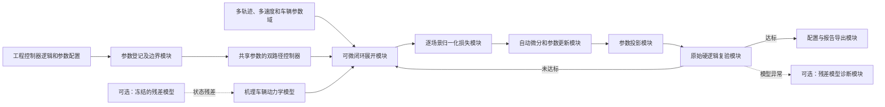
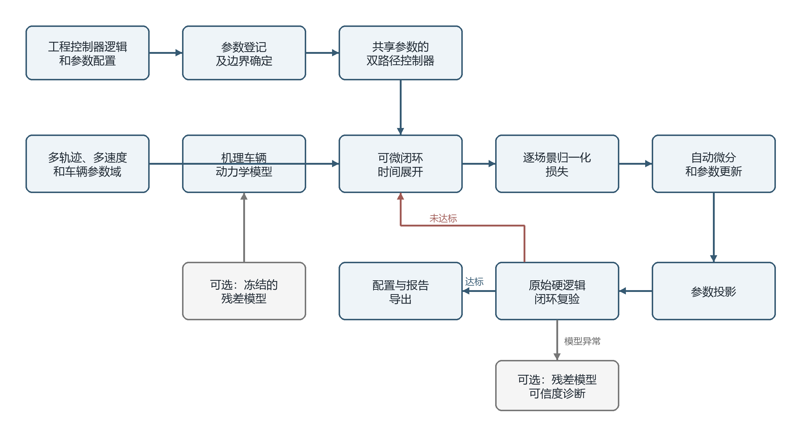
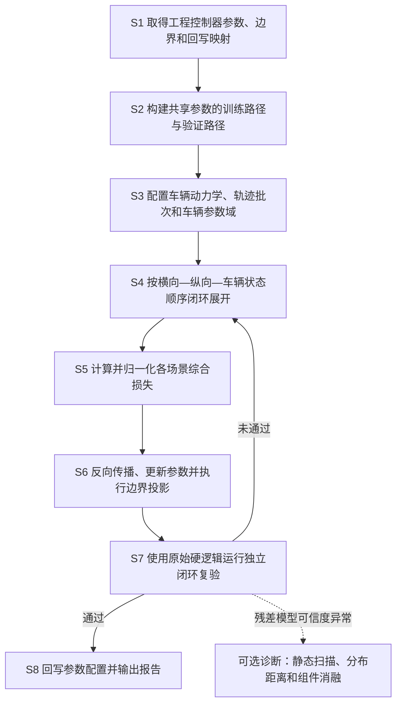
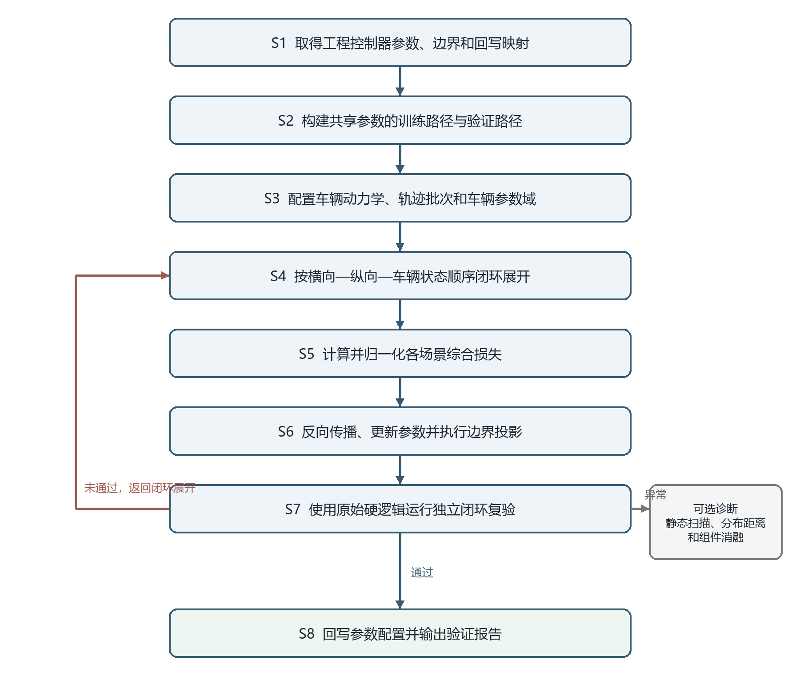
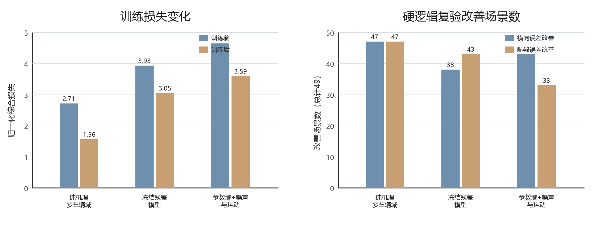

# 专利技术交底书

| 第一发明人（必填） |  | □　校招　/　□　社招　（必选） |  |
|---|---|---|---|
| 其他发明人（不超过3人） |  |  |  |
| （以下由交底书撰写人填写） |  | （以下由知识产权部填写） |  |
| 撰写人 |  | 专利类型 |  |
| 手机 |  | 知识产权负责人 |  |
| 座机 |  | 联系电话 |  |
| E-mail |  | E-mail |  |

**一种基于车辆动力学可微闭环仿真的车辆横纵向控制器参数自动整定方法**

## 一、技术背景、最接近现有技术及现有技术缺点

### 1.1 现有技术

检索说明：本次复核围绕“车辆控制器参数调节”“横纵向控制”“车辆动力学闭环”“可微仿真”“自动微分调参”“控制器标定”和“神经网络车辆动力学模型”等主题，在国家知识产权局专利公布公告系统、Google Patents 及公开论文页面中核验公开材料。以下内容按与本案技术链路的相关方向归纳，公开链接用于代理人复核著录项目和原始公开内容。

#### 1.1.1 车辆横向控制参数在线调节

**公开材料：** CN119734760A《一种车辆横向控制参数调节方法及系统》。

**公开内容：** 该方案实时比较目标位置与实际位置以获得横向偏差，并结合车辆动态状态和道路环境计算前馈转角与 LQR 调整转角，随后对方向盘综合转角进行约束并执行横向控制。

**与本案的区别：** 该方案针对车辆运行过程中的横向控制量和补偿转角进行在线调节，未涉及把既有横向、纵向工程控制器内部的预瞄表节点、位置环和速度环增益等标定参数作为待优化变量，也未公开多场景车辆动力学闭环的时间展开、自动微分更新、参数投影、原始硬逻辑复验和配置导出链路。

**公开来源：** [https://patents.google.com/patent/CN119734760A/zh](https://patents.google.com/patent/CN119734760A/zh)

#### 1.1.2 基于载重辨识的车辆纵向参数优化

**公开材料：** CN120517441A《一种基于载重辨识的车辆纵向控制参数优化方法及装置》。

**公开内容：** 该方案基于纵向动力学关系和车辆实际响应更新载重量，并利用更新后的载重信息修正油门控制量和制动控制量，以降低载重变化对纵向控制的影响。

**与本案的区别：** 该方案的重点是在线载重辨识及纵向控制量修正，没有将横向与纵向工程控制器的多组标定参数放入同一可微闭环中联合整定，也没有训练路径与原始硬逻辑验证路径共享参数的结构。

**公开来源：** [https://patents.google.com/patent/CN120517441A/zh](https://patents.google.com/patent/CN120517441A/zh)

#### 1.1.3 基于道路边界约束的车辆横纵向控制

**公开材料：** CN120308157A《一种基于道路边界约束的车辆横纵向控制方法及装置》。

**公开内容：** 该方案建立车辆非线性模型并形成状态转移关系，结合道路边界约束，通过迭代线性二次调节求取控制变量序列，进而生成车辆横向和纵向控制指令。

**与本案的区别：** 该方案的优化对象是当前规划或控制过程中的控制变量序列；本案的优化对象是既有工程控制器内部的标定参数，并要求整定后的参数回到保留原始限幅、分支和速率限制的控制器路径中复验和导出。

**公开来源：** [https://patents.google.com/patent/CN120308157A/zh](https://patents.google.com/patent/CN120308157A/zh)

#### 1.1.4 车辆控制器标定设备和通信流程

**公开材料：** CN112039742A《一种标定设备、车辆控制器标定方法及装置》。

**公开内容：** 该方案利用处理器、存储器、车辆通信接口和提示部件发送标定指令并接收控制器响应，以简化车辆控制器的标定操作和通信流程。

**与本案的区别：** 该方案解决的是标定设备及指令交互问题，未给出如何根据多场景轨迹误差建立可微闭环、如何获得控制器参数梯度、如何执行受约束参数更新以及如何进行部署前闭环复验。

**公开来源：** [https://patents.google.com/patent/CN112039742A/zh](https://patents.google.com/patent/CN112039742A/zh)

#### 1.1.5 利用学习型评价器调整运动规划器参数

**公开材料：** CN115907250A《用于调整自主驾驶车辆的运动规划器的基于学习的评论器》。

**公开内容：** 该方案训练学习型评价器，并以评价器建立的目标函数优化运动规划器参数，使基于规则的运动规划器在一个或多个驾驶环境中获得较优参数。

**与本案的区别：** 该方案位于运动规划层，评价对象是规划器生成的轨迹；本案位于车辆控制层，将横向和纵向工程控制器、车辆动力学状态更新及轨迹误差直接串成时间闭环，并针对非光滑工程逻辑建立训练路径和硬逻辑复验路径。

**公开来源：** [https://patents.google.com/patent/CN115907250A/zh](https://patents.google.com/patent/CN115907250A/zh)

#### 1.1.6 车辆横向标定参数的动态选择

**公开材料：** US11731648B2《Vehicle lateral-control system with dynamically adjustable calibrations》。

**公开内容：** 该方案依据天气、图像、车辆状态或道路条件等信息选择或调整车辆横向控制的调谐参数，使横向控制特性适配当前运行环境。

**与本案的区别：** 该方案侧重运行时的标定选择或动态切换；本案通过车辆动力学闭环和多场景损失对一组工程参数求梯度并更新，随后在原始硬逻辑下统一复验，不依赖预先枚举的环境—标定映射关系。

**公开来源：** [https://patents.google.com/patent/US11731648B2/en](https://patents.google.com/patent/US11731648B2/en)

#### 1.1.7 面向物理系统的通用可微机器

**公开材料：** US20220171353A1《Differentiable machines for physical systems》。

**公开内容：** 该方案把多个代表物理系统部件的可微模型通过集成层组合成可微机器，可用于建模、仿真、控制或参数调整物理系统。

**与本案的区别：** 该方案给出通用可微物理系统框架，未针对车辆横纵向工程控制器公开“同参数、双路径”的复现结构，也未公开面向查表、硬分支、限幅和速率限制的对应处理、按场景归一化的联合整定以及原配置格式回写。

**公开来源：** [https://patents.google.com/patent/US20220171353A1/en](https://patents.google.com/patent/US20220171353A1/en)

#### 1.1.8 神经网络车辆动力学模型

**公开材料：** US12007778B2《Neural network based vehicle dynamics model》。

**公开内容：** 该方案利用神经网络车辆动力学模型预测车辆状态或运动响应，以提高车辆行为建模能力。

**与本案的区别：** 该方案主要解决车辆动力学建模问题；本案的核心方案至少可采用机理动力学模型完成控制器参数整定，神经网络残差模型仅作为可选的被控对象增强，并在整定阶段保持权重冻结，避免把车辆模型训练与控制器调参混为同一优化对象。

**公开来源：** [https://patents.google.com/patent/US12007778B2/en](https://patents.google.com/patent/US12007778B2/en)

#### 1.1.9 基于自动微分的控制器自动调参

**公开材料：** Cheng 等《DiffTune: Auto-Tuning through Auto-Differentiation》，arXiv:2209.10021，后发表于 IEEE Transactions on Robotics。

**公开内容：** 该文把动力系统和控制器展开为计算图，以梯度方法优化控制器参数，并在 Dubins 车和四旋翼场景中验证控制器自动调参。

**与本案的区别：** 该文与本案在“沿闭环时间链路求控制器参数梯度”方面最接近；本案进一步面向已有车辆横向和纵向工程控制器，建立共享参数的可微训练路径与原始硬逻辑验证路径，覆盖速度分段、预瞄查表、限幅和速率限制等工程逻辑，并结合多轨迹多速度批处理、物理参数域、参数投影、验收门槛和配置导出形成可部署闭环。

**公开来源：** [https://arxiv.org/abs/2209.10021](https://arxiv.org/abs/2209.10021)

**检索结论与最接近现有技术判断：** 在本次检索范围内，DiffTune 与本案的自动微分调参机制最接近，CN119734760A、CN115907250A 分别在车辆横向参数调节和自动驾驶参数优化的应用方向上较为接近。尚未发现单一公开材料同时给出以下组合：从既有横纵向工程控制器中取得待整定参数；构建共享参数的可微训练路径和原始硬逻辑验证路径；在多轨迹、多速度及车辆参数域中闭环展开；对参数执行受约束梯度更新；通过硬逻辑复验后回写原配置格式。

### 1.2 现有技术存在的缺点

1. 现有车辆控制参数调节多为单一控制方向、在线查表或运行时参数切换，难以利用多轨迹、多速度和多车辆参数域一次性整定整组横纵向控制器参数。

2. 现有横纵向联合控制方法通常优化控制量序列或规划器参数，没有解决已有工程控制器内部预瞄表节点、位置环增益、速度环增益等标定参数的自动更新和原格式回写。

3. 工程控制器含有硬限幅、速率限制、最近点选择和条件分支，直接求导会出现梯度中断；完全改成平滑控制器又会使训练结果偏离部署逻辑。

4. 不同轨迹长度和误差量级差异较大，若不做逐场景归一化，少数长轨迹或高误差场景会主导参数更新。

5. 现有方案较少把训练结果重新放回原始硬逻辑路径进行统一复验，难以证明自动更新后的参数能够在工程限幅和分支条件下稳定使用。

6. 当被控对象采用学习型车辆模型时，控制器参数不足与车辆模型分布外失效容易相互混淆，缺少冻结模型、组件消融和输入分布诊断的可追溯机制。

## 二、本发明所要解决的技术问题

本发明旨在不改变既有车辆横向和纵向工程控制器主体结构的前提下，把控制器参数、参考轨迹查询、车辆状态更新和性能评价连成可微闭环，使整组控制器标定参数能够根据多场景闭环结果自动更新。

本发明还要解决可微训练与工程部署之间的矛盾：训练阶段为非光滑步骤建立能够传递梯度的对应计算，验证阶段仍采用原始硬限幅、硬分支和硬速率限制；两条路径共享同一组参数，从而使训练所得参数可以在工程逻辑下直接复验。

本发明进一步解决多场景权重失衡、车辆物理参数不确定性和可部署边界约束问题。系统对各场景损失进行归一化，在多轨迹、多速度和多车辆参数域中批量展开，并在每次参数更新后执行物理边界投影，只有通过硬逻辑验收门槛的参数才被导出。

在可选实施方式中，本发明还解决机理模型精度不足以及学习型残差模型失效难以归因的问题：采用机理模型给出主体响应、冻结的残差模型补偿剩余误差，并通过输入分布距离、静态扫描和组件消融判断异常来源。该可选方式不构成核心整定方法的必要条件。

## 三、本发明技术方案的详细阐述

### 3.1 总体思路

车辆控制模块按固定周期运行。每一周期先依据参考轨迹和当前车辆状态计算横向指令，再依据目标速度、位置误差和速度误差计算纵向指令，随后由车辆动力学模型更新下一周期状态。多个周期连续执行后，当前参数不仅影响本周期控制输出，还会通过车辆状态影响后续全部周期的误差。

本发明利用上述时间依赖关系，将横向和纵向工程控制器复现为两条共享参数的计算路径。训练路径保持控制律的主要物理关系，并对部分非光滑环节采用平滑混合、梯度直通或梯度隔离；验证路径保持原工程控制器的硬逻辑。训练路径用于获得参数更新方向，验证路径用于判断更新后的参数能否部署。

**核心技术主线：** 参数登记与边界确定 → 双路径控制器复现 → 多场景车辆动力学闭环展开 → 逐场景归一化损失 → 自动微分与参数投影 → 原始硬逻辑复验 → 参数配置导出。

机理动力学模型是被控对象的最低构成。对于需要提高车辆响应逼真度的场景，可以在机理状态更新后叠加冻结的 MLP 残差模型；该残差模型的权重不参加控制器参数整定。

### 3.2 系统框图

<!--  -->

*图1 可微闭环参数自动整定系统框图*

### 3.3 模块功能说明

1. **参数登记及边界模块。** 从工程控制器代码、参数文件或人工指定清单中取得候选标定参数，将其划分为待整定参数、固定物理参数和安全约束参数，并记录参数在原配置中的名称、形状、单位、初始值、上下界及回写位置。

2. **双路径控制器。** 训练路径和验证路径采用同一横向、纵向控制结构并引用同一组待整定参数；二者仅在非光滑环节的计算方式上不同。验证路径的输出应与原工程控制器在预设容差内一致。

3. **场景与车辆参数域。** 场景至少包括多种轨迹形状和多个速度段；可进一步对车辆质量、侧偏刚度、轮胎或传动参数进行采样。各场景保存参考位置、航向、曲率和速度随时间或距离的变化。

4. **被控对象。** 机理动力学模型根据车辆状态、控制指令和车辆物理参数给出下一周期状态。机理模型可以是运动学自行车模型、动力学自行车模型或牵引车—挂车双体动力学模型。

5. **可选残差增强。** 冻结的残差模型接收车辆状态、控制指令和车辆配置等特征，输出速度或位姿残差；残差经过坐标转换、限幅和车辆构型掩码后叠加到机理预测状态。梯度可以经过其输入输出映射回到控制器参数，但不更新残差模型权重。

6. **闭环展开模块。** 按控制周期串联参考轨迹查询、横向控制、纵向控制和车辆状态更新；可采用完整时间反向传播，也可按长度为 $K$ 的窗口截断并继续向前推进，以控制存储量和梯度稳定性。

7. **损失与归一化模块。** 分别计算横向误差、航向误差、速度误差、转向变化、纵向指令变化和参数偏移；先对各场景按其基准损失或有效时长归一化，再对批量场景求平均。

8. **参数更新与投影模块。** 根据综合损失对待整定参数的梯度执行优化更新，并把更新结果投影到对应物理和安全边界内；固定物理参数和安全参数不参与更新。

9. **硬逻辑复验与导出模块。** 将候选参数送入验证路径，在独立场景集或全量场景集上运行闭环；仅在跟踪误差、控制平滑性、数值稳定性和参数边界均满足预设门槛时，生成与原控制器配置格式一致或可转换的参数文件。

10. **可选诊断模块。** 在混合被控对象出现异常时记录残差模型输入、归一化距离、原始输出、限幅后输出和车辆响应，并通过无激励静态扫描、纯机理对照和残差分量消融定位异常来源。

### 3.4 系统流程说明

<!--  -->

*图2 控制器参数自动整定方法流程图*

具体步骤如下：

1. **S1，取得参数及边界。** 读取控制器逻辑和配置，建立参数登记表。对于查找表，仅把允许变化的纵坐标节点列为待整定参数，横坐标速度断点保持固定；对于位置环和速度环，登记比例、积分增益及速度切换阈值；对于转向角、加速度和速率上限等安全量，默认保持固定。

2. **S2，构建双路径控制器。** 对每一非光滑环节建立训练计算与验证计算的对应关系。两条路径共用参数对象、参数单位和配置映射，避免训练后还需人工搬运或重新解释参数。

3. **S3，配置场景批次。** 将轨迹类型、速度段和车辆物理参数组合成批量场景。不同长度的轨迹可用有效步掩码参与损失计算，填充部分不计入损失。

4. **S4，闭环展开。** 在每个有效控制周期内，先计算横向指令，再计算纵向指令，最后更新车辆状态。下一周期控制器读取前一周期的车辆状态，形成时间闭环。

5. **S5，计算综合损失。** 对每个场景计算跟踪误差和平滑性损失，并以初始参数下的场景损失或其它预设基准进行归一化，减小场景尺度差异。

6. **S6，更新并投影参数。** 沿闭环时间链路求参数梯度，执行梯度裁剪、优化器更新和边界投影。窗口式反向传播时，在窗口边界只截断历史梯度，不重置车辆和控制器内部状态的数值。

7. **S7，硬逻辑复验。** 将候选参数送入保留原始限幅、分支和速率限制的验证路径。若任一关键指标超出验收阈值，或出现非有限数值、控制命令越界和车辆状态发散，则不导出为部署配置。

8. **S8，导出配置。** 将通过复验的参数按原名称、形状、单位和顺序写回配置文件，同时保存训练超参数、参数变化、场景统计和验证结论。

#### 3.4.1 符号、双路径映射与核心公式

##### （1）非光滑工程逻辑的双路径映射

| 工程环节 | 验证路径 | 训练路径 | 参数共享关系 |
|---|---|---|---|
| 查找表 | 原始断点查表或线性插值 | 固定横坐标断点，对允许变化的纵坐标节点执行可微插值 | 两条路径使用同一组表节点值 |
| 高低速分支 | 按切换阈值执行硬分支 | 以连续权重混合两个分支输出 | 共用切换阈值和两组增益 |
| 上下限幅 | 原始硬裁剪 | 采用平滑边界，或保持前向硬裁剪并令反向梯度直通 | 共用上下界；安全界默认固定 |
| 速率限制 | 原始相邻周期增量裁剪 | 保持受限前向值并传递近似梯度 | 共用速率上限 |
| 最近点或离散索引 | 原始离散选择 | 索引选择不求导，选中后的连续几何量参与后续求导 | 共用轨迹和查询规则 |

以高低速控制分支为例，设 $v_{b,t}$ 为当前速度，$v_{\mathrm{sw}}$ 为可调切换速度，$\tau>0$ 为固定平滑尺度，$y_{\mathrm{low}}$ 与 $y_{\mathrm{high}}$ 为两个分支输出，则训练路径可采用：

\[
\alpha_{b,t}=\sigma\left(\frac{v_{b,t}-v_{\mathrm{sw}}}{\tau}\right),\quad y^{\mathrm{tr}}_{b,t}=(1-\alpha_{b,t})y_{\mathrm{low}}+\alpha_{b,t}y_{\mathrm{high}} \qquad \mathrm{(1)}
\]

验证路径仍在 $v_{b,t}$ 与 $v_{\mathrm{sw}}$ 的比较结果上选择单一分支。平滑尺度 $\tau$ 只用于训练路径，不写回部署配置。

##### （2）符号与变量定义

| 符号 | 含义 | 下标、量纲或取值 |
|---|---|---|
| $b$ | 批量场景索引 | $b=1,\ldots,B$ |
| $t$ | 控制周期索引 | $t=0,\ldots,T_b$，实施例周期为 0.02 s |
| $x_{b,t}$ | 场景 $b$ 在周期 $t$ 的车辆状态 | 位置、航向、速度、横摆角速度等 |
| $r_{b,t}$ | 参考轨迹状态 | 参考位置、航向、曲率和速度 |
| $u_{b,t}=(\delta_{b,t},q_{b,t})$ | 控制指令 | $\delta$ 为转向指令；$q$ 为加速度、驱动力或车轮扭矩指令 |
| $\theta=(\theta_{\mathrm{lat}},\theta_{\mathrm{lon}})$ | 待整定控制器参数 | 横向参数与纵向参数的集合 |
| $\theta_0$ | 初始工程标定参数 | 与 $\theta$ 同形、同单位 |
| $\Theta$ | 参数可部署集合 | 由每个参数的上下界共同确定 |
| $\phi_b$ | 场景 $b$ 的车辆物理参数 | 质量、侧偏刚度、轮胎和传动参数等 |
| $g_{\mathrm{tr}}(\cdot)$ | 训练路径控制器映射 | 可微或采用近似梯度 |
| $g_{\mathrm{hard}}(\cdot)$ | 验证路径控制器映射 | 保留原始工程硬逻辑 |
| $F_{\mathrm{mech}}(\cdot)$ | 机理车辆动力学状态转移 | 输出下一周期名义状态 |
| $h_{\psi}(\cdot)$ | 可选残差模型 | $\psi$ 为冻结权重 |
| $z_{b,t}$ | 可选残差模型输入特征 | 由车辆状态、控制指令和车辆配置构成 |
| $\mathcal{T}(\cdot)$ | 残差转换算子 | 坐标转换、限幅和构型掩码 |
| $e_{b,t,\mathrm{lat}}$ | 横向跟踪误差 | m |
| $e_{b,t,\mathrm{head}}$ | 航向误差 | rad |
| $e_{b,t,\mathrm{spd}}$ | 速度误差 | m/s |
| $\Delta\delta_{b,t},\Delta q_{b,t}$ | 相邻周期控制指令变化 | 仅在 $t\geq1$ 时定义 |
| $\ell_b(\theta)$ | 单场景未归一化损失 | 非负标量 |
| $\ell_{b,\mathrm{ref}}$ | 场景 $b$ 的基准损失 | 由初始参数或预设基准运行得到 |
| $J(\theta)$ | 批量综合目标函数 | 非负标量 |
| $\eta_k$ | 第 $k$ 次参数更新的步长 | 正数 |
| $\Pi_{\Theta}(\cdot)$ | 参数投影算子 | 将参数限制在 $\Theta$ 内 |

##### （3）闭环状态更新

训练路径在场景 $b$ 的周期 $t$ 产生控制指令：

\[
u_{b,t}=g_{\mathrm{tr}}(x_{b,t},r_{b,t};\theta) \qquad \mathrm{(2)}
\]

机理动力学模型给出下一周期名义状态：

\[
x^{\mathrm{mech}}_{b,t+1}=F_{\mathrm{mech}}(x_{b,t},u_{b,t};\phi_b) \qquad \mathrm{(3)}
\]

在采用残差增强的可选实施方式中，完整状态更新为：

\[
x_{b,t+1}=x^{\mathrm{mech}}_{b,t+1}+\mathcal{T}\left(h_{\psi}(z_{b,t})\right) \qquad \mathrm{(4)}
\]

不采用残差模型时，令残差项为零，即 $x_{b,t+1}=x^{\mathrm{mech}}_{b,t+1}$。因此，残差模型不构成核心闭环整定方法的必要条件。

##### （4）逐场景损失、归一化与参数更新

令 $w_{\mathrm{lat}},w_{\mathrm{head}},w_{\mathrm{spd}},w_{\Delta\delta},w_{\Delta q}$ 为正权重。单场景损失为：

\[
\begin{aligned}
\ell_b(\theta)=&\frac{1}{T_b+1}\sum_{t=0}^{T_b}\left(w_{\mathrm{lat}}e_{b,t,\mathrm{lat}}^2+w_{\mathrm{head}}e_{b,t,\mathrm{head}}^2+w_{\mathrm{spd}}e_{b,t,\mathrm{spd}}^2\right)\\
&+\frac{1}{\max(T_b,1)}\sum_{t=1}^{T_b}\left(w_{\Delta\delta}\Delta\delta_{b,t}^2+w_{\Delta q}\Delta q_{b,t}^2\right) \qquad \mathrm{(5)}
\end{aligned}
\]

其中，$\Delta\delta_{b,t}=\delta_{b,t}-\delta_{b,t-1}$，$\Delta q_{b,t}=q_{b,t}-q_{b,t-1}$。平滑项从 $t=1$ 开始累计，避免使用未定义的前一周期指令。

为减少不同轨迹量级差异对训练的影响，令 $\epsilon>0$ 为防止分母为零的小常数，$\lambda\geq0$ 为参数偏移正则权重，则批量目标函数为：

\[
J(\theta)=\frac{1}{B}\sum_{b=1}^{B}\frac{\ell_b(\theta)}{\ell_{b,\mathrm{ref}}+\epsilon}+\lambda\lVert\theta-\theta_0\rVert_2^2 \qquad \mathrm{(6)}
\]

第 $k$ 次更新先依据梯度得到候选参数，再执行物理边界投影：

\[
\widetilde{\theta}^{k+1}=\theta^k-\eta_k\widehat{\nabla_{\theta}J(\theta^k)},\quad \theta^{k+1}=\Pi_{\Theta}\left(\widetilde{\theta}^{k+1}\right) \qquad \mathrm{(7)}
\]

其中，$\widehat{\nabla_{\theta}J}$ 表示可经过预设范数裁剪的梯度。参数投影至少保证横向时间类参数和 PID 增益非负，并把速度切换阈值等参数限制在工程范围内。

训练完成后，以候选参数 $\theta^*$ 运行 $g_{\mathrm{hard}}(\cdot)$。验证路径使用相同参数、相同单位和相同配置映射，但恢复原始硬分支、硬限幅和硬速率限制。只有在全量验证结果满足预设阈值时，$\theta^*$ 才被写入部署配置。

### 3.5 关键技术参数

下表中的具体数值为一个实施例，用于说明可实施性，不作为权利要求限制。

| 符号或参数组 | 参数内容 | 实施例约束或取值 | 作用 |
|---|---|---|---|
| $\Delta t$ | 控制周期 | 0.02 s，即 50 Hz | 决定闭环离散时间步长 |
| $\theta_{\mathrm{lat}}$ | 横向预瞄、收敛、角速度误差预瞄及远预瞄查表节点 | 时间类节点非负；速度断点固定 | 调节横向跟踪与转向平滑性 |
| $\theta_{\mathrm{lon}}$ | 位置环、低速速度环、高速速度环增益及切换速度 | 增益非负；切换速度 0.5–10 m/s | 调节速度跟踪和加减速响应 |
| $B$ | 同步闭环场景数 | 基础训练为 48；四组车辆参数域时为 192 | 批量覆盖多轨迹、多速度和车辆域 |
| $K$ | 窗口式反向传播长度 | 150 步，即 3 s | 控制计算图长度和梯度稳定性 |
| $w_{\mathrm{lat}},w_{\mathrm{head}},w_{\mathrm{spd}}$ | 跟踪误差权重 | 10、8、3 | 平衡横向、航向和速度目标 |
| $w_{\Delta\delta},w_{\Delta q}$ | 控制平滑权重 | 0.05、0.01 | 抑制转向和纵向指令突变 |
| $\lambda$ | 参数偏移正则权重 | 0.01 | 避免参数过度偏离初始标定 |
| 梯度裁剪阈值 | 梯度范数上限 | 10 | 防止极端场景产生不稳定更新 |
| $\phi_b$ | 车辆参数域 | 质量为名义值的 ±10%；前后轴侧偏刚度为 ±20% | 提高对车辆差异的鲁棒性 |
| $\psi$ | 可选残差模型权重 | 在控制器整定阶段固定 | 只修正被控对象，不与控制器参数联合训练 |

## 四、与现有技术相比的有益效果

1. 本发明直接整定已有车辆横向和纵向工程控制器内部的标定参数，输出仍可回写原配置，不需要把工程控制器替换为端到端网络。

2. 训练路径与验证路径共享参数，训练阶段能够获得梯度，部署前又能恢复原始硬逻辑，兼顾可优化性和工程一致性。

3. 横向控制、纵向控制和车辆动力学按真实控制周期串联，使若干周期后的轨迹误差能够反向影响预瞄表节点、位置环和速度环参数。

4. 逐场景归一化和批量多域训练降低了长轨迹、高误差轨迹或单一车辆参数支配更新的风险。

5. 参数投影、梯度裁剪和硬逻辑验收门槛共同限制自动更新结果，减少参数越过物理或安全边界的可能性。

6. 参数登记表保留原名称、形状、单位、边界和回写位置，使整定过程、验证结果和配置导出具有可追溯性。

7. 可选的机理模型加冻结残差模型方式在不改变核心优化对象的前提下提高车辆响应逼真度；可选诊断流程能够区分控制器不足和残差模型失效。

## 五、本发明的技术关键点和保护点

### 5.1 建议独立权利要求的核心主线

1. 一种车辆横纵向控制器参数自动整定方法，包括：取得工程控制器的待整定参数及参数边界；构建共享所述待整定参数的训练路径和验证路径；在多个轨迹场景中按控制周期串联横向控制、纵向控制和车辆动力学状态更新；根据闭环状态计算归一化综合损失；沿时间链路获得参数梯度并执行参数更新和边界投影；将候选参数送入保留原始硬逻辑的验证路径复验；在满足验收条件后按原配置映射导出参数。

2. 上述独立主线中的“双路径共享参数、可微闭环更新、物理边界投影、原始硬逻辑复验和配置回写”建议作为相互配合的核心技术特征。独立权利要求不宜把 MLP 残差模型、特定车辆类型、特定轨迹数量或具体损失权重写成必要限定。

### 5.2 建议从属保护层级

1. 训练路径对高低速分支采用连续权重混合，对速率限制或限幅采用前向受限、反向近似传递梯度的方式，并使验证路径恢复硬分支和硬限制。

2. 待整定参数包括横向预瞄类查表节点、收敛类查表节点、角速度误差预瞄节点、远预瞄节点、纵向位置环增益、速度环增益和速度切换阈值中的一种或多种。

3. 横向控制器先于纵向控制器执行，二者输出共同驱动车辆动力学模型，多个周期后的状态误差反向作用于横纵向参数。

4. 各场景损失先以场景基准损失归一化，再在轨迹类型、速度段和车辆参数域组成的批量场景中求平均。

5. 采用窗口式时间反向传播，窗口边界截断历史梯度但保留车辆状态和控制器内部状态的连续数值。

6. 更新后的查表节点和增益通过投影限制在各自上下界内，并按参数登记表回写到原配置中的对应名称、形状、单位和位置。

7. 训练阶段加入车辆质量、侧偏刚度、轮胎或传动参数采样，或者加入反馈噪声和控制指令抖动；验证阶段关闭所述训练扰动。

8. 被控对象包括机理动力学模型和可选的冻结残差模型，残差模型权重不更新，但允许梯度经其输入输出映射回到控制器参数。

9. 对残差模型执行无激励静态扫描、输入分布外距离计算、纯机理对照和输出分量消融，以判断闭环异常来源。

10. 硬逻辑验收条件包括跟踪误差、控制平滑性、参数边界、非有限数值、控制命令越界和车辆状态发散中的一种或多种。

### 5.3 建议并行保护的主题

在同一发明构思下，还可设置与上述方法对应的控制器参数自动整定系统、电子设备和计算机可读存储介质。系统模块可对应参数登记、双路径控制、场景生成、闭环展开、损失计算、自动微分、参数投影、硬逻辑复验和配置导出模块。

## 六、实施例、技术效果和参数示例

以下数据用于证明方案已经实现并能够取得技术效果，不限定权利要求的轨迹数量、速度范围、优化轮数、损失权重、车辆参数范围或模型形式。

### 6.1 实施例一：纯机理被控对象下的多车辆参数域整定

横向控制器采用重型车辆横向控制逻辑，纵向控制器包括位置环、低速速度环、高速速度环和车轮扭矩输出。被控对象采用牵引车—挂车机理动力学模型，不启用 MLP 残差模型。

基础训练集含 8 类轨迹，每类覆盖 5、18、25、35、45 和 55 km/h 六个速度段，共 48 条轨迹。每轮训练采样 4 组车辆参数，将基础训练集复制到 4 个车辆域，形成 192 条同步闭环样本；牵引车质量在名义值 ±10% 范围内采样，前后轴侧偏刚度在名义值 ±20% 范围内采样。

经过 6 轮训练，综合损失由 2.7083 降至 1.5639，下降 42.26%。使用原始硬逻辑在 49 个场景中复验，47 个场景的横向误差下降，47 个场景的航向误差下降；横向误差变化平均值为 −29.32%，航向误差变化平均值为 −24.87%。该实施例说明核心整定方案可以在不使用残差模型的情况下实施。

### 6.2 实施例二：叠加冻结残差模型的闭环整定

在另一实施例中，牵引车—挂车机理动力学模型后叠加冻结的 MLP 残差模型。残差模型接收车辆状态、控制指令、车辆配置和铰接状态等特征，输出速度或相对位姿残差；残差经转换后修正下一周期车辆状态。整定过程中只更新控制器参数，不更新残差模型权重。

经过 6 轮训练，综合损失由 3.9303 降至 3.0535，下降 22.31%。49 个硬逻辑复验场景中，38 个场景的横向误差下降，43 个场景的航向误差下降；横向误差变化平均值为 −11.20%，航向误差变化平均值为 −15.11%。

### 6.3 实施例三：车辆参数域、反馈噪声和指令抖动联合训练

在另一实施例中，同时启用车辆参数域随机化、反馈噪声和指令抖动。反馈噪声作用于位置、航向、速度和横摆角速度等控制器输入；指令抖动作用于转向和车轮扭矩指令。损失始终使用车辆真实状态计算，硬逻辑复验阶段关闭上述噪声和抖动。

经过 6 轮训练，综合损失由 4.6378 降至 3.5931，下降 22.53%。49 个硬逻辑复验场景中，43 个场景的横向误差下降，33 个场景的航向误差下降；横向误差变化平均值为 −17.61%。

*图3 三组实施例的训练损失与硬逻辑复验摘要*

### 6.4 实施例四：残差模型可信度诊断

当混合被控对象在特定场景出现误差突增时，系统先运行纯机理路径和完整残差路径，再依次屏蔽牵引车速度残差、挂车速度残差或相对位姿残差。若屏蔽某一残差分量后误差恢复到纯机理水平，则该分量被标记为主要异常来源；若两条路径均出现相似误差，则优先检查控制器参数和控制器结构。

系统还可在无侧向速度、无横摆角速度和无控制激励的输入条件下扫描纵向速度。若残差模型在该条件下持续输出侧向残差，则说明模型存在无激励偏置；该偏置在 50 Hz 闭环中会逐周期积累，并诱发控制器进行反向补偿。诊断结论用于决定是否更换残差模型、限制其使用域或回到纯机理模型继续整定，不改变已经导出的控制器参数含义。

### 6.5 可实施性及替代方式

本发明可在通用计算设备、仿真服务器或车端开发环境中实施。控制器可以是 PID、前馈—反馈组合、查表控制器或含分段增益的其它工程控制器；车辆动力学模型可以采用运动学模型、单体动力学模型或牵引车—挂车模型；参数优化器可以采用一阶梯度方法或其它利用闭环梯度的更新方法。

训练完成后，系统输出参数配置、参数变化记录、训练超参数、场景级验证指标和验收结论。上述输出不限定具体编程语言、软件目录、配置文件扩展名或图表样式。
